Table of Contents 
=================

[1. Accessing Euromonitor data 3](#accessing-euromonitor-data)

[1.1 Location of data set 3](#location-of-data-set)

[1.2 Industries (IND) 3](#industries-ind)

[1.3 Data available 5](#data-available)

[2. Sample refinement 6](#sample-refinement)

[3. Data sources 6](#data-sources)

[4. Variables 6](#variables)

[4.1 How to code 10](#how-to-code)

[4.2 Countries 10](#countries)

[4.2.1 Home Country (HOME) 10](#home-country-home)

[4.2.2 Host country (HOST) 10](#host-country-host)

[4.3. Application Resource variables 10](#application-resource-variables)

[4.3.1 API (API) 10](#api-api)

[4.3.2 API Endpoint (END) - DROPPED 12](#api-endpoint-end---dropped)

[4.3.3 API Method (METH) 13](#api-method-meth)

[4.4 Developer Resource variables 15](#developer-resource-variables)

[4.4.1 Developer portal (DEVP) 15](#developer-portal-devp)

[4.4.2 Documentation (DOCS) 16](#documentation-docs)

[4.4.3 Software Development Kit (SDK) 19](#software-development-kit-sdk)

[4.4.4 Debugger tools (BUG) 22](#debugger-tools-bug)

[4.4.5 Standards & Interoperability (STAN) 24](#standards-interoperability-stan)

[4.5 AI Resource variables 26](#ai-resource-variables)

[4.5.1 AI Model Access & APIs (AI\_MODEL) 26](#ai-model-access-apis-ai_model)

[4.5.2 AI Agent & Assistant Integrations (AI\_AGENT) 27](#ai-agent-assistant-integrations-ai_agent)

[4.5.3 AI-Assisted Development (AI\_ASSIST) 28](#ai-assisted-development-ai_assist)

[4.5.4 AI Context & Data Exposure AI\_DATA 29](#ai-context-data-exposure-ai_data)

[4.5.5 AI Extensions & Marketplaces (AI\_MKT) 30](#ai-extensions-marketplaces-ai_mkt)

[4.6 Governance Resource variables 31](#governance-resource-variables)

[4.6.1 Roles (ROLE) 31](#roles-role)

[4.6.2 Data (DATA) 34](#data-data)

[4.6.3 Marketplace/App Store (STORE) 37](#marketplaceapp-store-store)

[4.6.4 Registration of the App/Certification (CERT) 38](#registration-of-the-appcertification-cert)

[4.6.5 Open Access (OPEN) - DROPPED 41](#open-access-open---dropped)

[4.7 Social Resource variables 44](#social-resource-variables)

[4.7.1 Multiple communications channels (COM) 44](#multiple-communications-channels-com)

[4.7.2 Github (GIT) 50](#github-git)

[4.7.3 Monetization tools/ Reward systems (MON) 55](#monetization-tools-reward-systems-mon)

[4.7.4 Programs/events/hackathon/ meet ups (EVENT) 59](#programseventshackathon-meet-ups-event)

[4.7.5 Boundary spanner roles (SPAN) 64](#boundary-spanner-roles-span)

[4.9 Language variables 70](#language-variables)

[4.9.1 Linguistic Varity (linguistic\_variety) 70](#linguistic-varity-linguistic_variety)

[4.9.2 Linguistic Variety list (linguistic\_variety\_list) 71](#linguistic-variety-list-linguistic_variety_list)

[4.9.3 Programming Language Variety (programming\_lang\_variety) 71](#programming-language-variety-programming_lang_variety)

[4.9.4 Programming Language Variety list
(programming\_lang\_variety\_list) 73](#programming-language-variety-list-programming_lang_variety_list)

[4.9.5 Home Primary Language (home\_primary\_lang) 73](#home-primary-language-home_primary_lang)

[4.9.6 Language notes (language\_notes) 73](#language-notes-language_notes)

[5. Platform Metadata 73](#platform-metadata)

[5.1 Platform (PLAT) 73](#platform-plat)

[5.2 PLAT\_notes 74](#plat_notes)

[5.3 Industry (IND) 74](#industry-ind)

[5.5 Industry ID (IND\_ID) 74](#industry-id-ind_id)

[6. Platform-level Control variables 74](#platform-level-control-variables)

[6.1 Age of the platform (AGE) - DROPPED 74](#age-of-the-platform-age---dropped)

[6.2 API Year (API\_Year) - DROPPED 75](#api-year-api_year---dropped)

[6.3 Industry growth (IND\_GROW) 75](#industry-growth-ind_grow)

[7. Home Country Control Variables 76](#home-country-control-variables)

[7.1 GDP Per Capita 76](#gdp-per-capita)

[7.2 Internet users 77](#internet-users)

[7.3 Population 78](#population)

[7.4 English Proficiency 78](#english-proficiency)

[8. Moderator - Cultural\_distance 78](#moderator---cultural_distance)

[9. Dependent variables 79](#dependent-variables)

[9.1 Market Share (market\_share\_pct) 79](#market-share-market_share_pct)

[10. Computed variables 79](#computed-variables)

[9.1 Computing a score for each boundary resource class 79](#computing-a-score-for-each-boundary-resource-class)

[9.2 Computing the composite platform resources score 80](#computing-the-composite-platform-resources-score)

[9.3 Mediator - Ecosystem accessibility (ecosystem\_accessibility) 80](#mediator---ecosystem-accessibility-ecosystem_accessibility)

1. Accessing Euromonitor data 
=============================

1.1 Location of data set 
------------------------

HUMAN DIRECTION: Access UNCG library> databases>Euromonitor passport

From this link <https://www-portal-euromonitor-com.libproxy.uncg.edu/magazine/homemain/>

Euromonitor data is used to establish the baseline industry market data and list of companies in the market.

1.2 Industries (IND)
--------------------

HUMAN DIRECTION:

Use the Industry search filters.

Initial industry search is limited as listed below. Data sets will be chosen and kept grouped at the same level (3rd level) for consistency.

| **Top level category** | **Industry description** | **Euromonitor industry label** | **Date range** | **Industry Units (Market Size/ % YOY)** | **Company Units** | **Use in data** |
| --- | --- | --- | --- | --- | --- | --- |
| Appliances and Electronics | Consumer Appliance | | | | | NO |
| Appliances and Electronics | Consumer electronics | In-car entertainment | 2020-2025 | Retail volume | Retail volume | YES |
| Appliances and Electronics | Consumer electronics | Computers and Peripherals | 2020-2025 | Retail volume | Retail volume | YES |
| Appliances and Electronics | Consumer electronics | In-Home Consumer Electronics *(include home audio, cinema, home video)* | 2020-2025 | Retail volume | Retail volume | YES |
| Appliances and Electronics | Consumer electronics | Portable Consumer Electronics *(includes wireless headphones, imaging devices, mobile phones, portable players, wearables)* | 2020-2025 | Retail volume | Retail volume | YES |
| Appliances and Electronics | Toys & Games | Video games | 2019-2024 | Retail Value RSP | Retail Value RSP | YES |
| Appliances and Electronics | Toys & Games | Traditional Toys and Games | 2019-2024 | Retail Value RSP | Retail Value RSP | YES |
| Drinks | | | | | | NO |
| Food and Nutrition | | | | | | NO |
| Health and Beauty | | | | | | NO |
| Home Products | | | | | | NO |
| Luxury and Fashion | | | | | | NO |
| Nicotine and Cannabis | | | | | | NO |
| Services | Consumer Foodservice | Consumer Foodservice by Ordering Platform ** (others skipped)** | 2019-2024 | Foodservice Value RSP | Foodservice Value RSP | YES |
| Services | Payments and Lending | Financial Cards and Payments **\*need to narrow category** | 2020-2024 | ~ ~Number of Cards~~ Retail Value RSP | ~ ~Number of Cards~~ Retail Value RSP | YES |
| Services | Payments and Lending | Consumer Lending | | No company shares | | NO |
| Services | Payments and Lending | E-Commerce in Proximity Location by Industry | | No company shares | | NO |
| Services | Travel | Tourism Flow | | No company shares | | NO |
| Services | Travel | Travel Modes (includes Airlines and Surface Travel Modes) **\ *\*need to drop data that is "modelled"** | 2020-2025 | Retail Value RSP | Retail Value RSP | YES |
| Services | Travel | Lodging **\ *\*need to drop data that is "modelled"** | 2020-2025 | Retail Value RSP | Retail Value RSP | YES |
| Services | Travel | In-Destination Spending | | | | NO |
| Services | Travel | Booking | | | | NO |
| B2B | Ingredients | | | | | NO |
| B2B | Packaging | | | | | NO |

Select the industry filter> and download the industry list based on the selected third level category (ie: Video Games is a third level within Appliance and Electronics)

In geography select ALL using the hierarchy icon on the right of the region list. However, deselect the regional name at the top of each regional country list so that the region does not populate the download file and introduce an extraneous row. Select either Company Shares or Market Size as the data needed as you can toggle between when in the data presentation view.

Download the Market Size data.

Then use "Convert Data" to access to access Industry growth data. Change to Growth > Year on year growth (%) to obtain the measure for Industry Growth Control. Repeat for Period Growth so you have both values.

Download Company Share data by switching "Change Stats Type".

Access "Calculation Variables" if you need to pull down additional control data per country such as population, households, inflation, and units of local currency separate from the WDI indicators.

When you switch, make sure to check time range.

**Final list of industries to use:**

In-car entertainment

Computers and Peripherals

In-Home Consumer Electronics

Portable Consumer Electronics

Video games

Traditional Toys and Games

Consumer Foodservice by Ordering Platform

Financial Cards and Payments

Travel Modes (includes Airlines and Surface Travel Modes)

Lodging

Note: Travel Modes includes Airlines and Surface Travel Modes; Lodging include hotels.

1.3 Data available
------------------

Euromonitor Passport contains the following possible data sources:

- Market shares (lists the market shares for the overall industry per
 country)

- Company shares (lists the market share data for each company by
 country)

- Brand shares (lists the market share data for each brand by company
 by country)

- Retail sales (lists the retail sales data for each company by
 country)

2. Sample refinement
====================

Euromonitor data will be refined to a smaller set of firms in a select number of industries where:

- Limit to industries where Market Size and Company Share is
 available.

- Data is available for 5 year ranges. 2025 data is not yet available
 for all industries.

- There are no gaps in data available

- Firm operates in more than one country (has a data row of market
 share for at least 2 countries)

3. Data sources
===============

Data in this analysis comes from

1) Euromonitor data on company market share, revenue. This serves the basis for industry classification and controls related to industry growth. Additional controls on the firm for size, revenue, etc. are provided.

2) WDI indicators for GDP from WorldBank

3) internet users, population come from Euromonitor data downloads

4) EF rankings on English language proficiency (supplemental)

5) Hofstede culture scores to compute cultural distance

6) Web scraping of developer portal sites for identified companies produce the coding for each home-host country dyad pair. The analysis for this coding will be done by AI agents using Claude and OpenAI ChatGPT with one human coder operating in the calibration stage.

4. Variables
============

Each section describes how to locate and code the variables for the study. The headers in this document contains the main variable name and the coded abbreviation in parenthesis that will be used in the excel data collection file called CODEBOOK.xlxs.

Within some of these sections, additional sub variables are identified to capture detail during coding such as count of pages, count of languages, count of programming languages, or note details on these findings. Look for "additional variables" identified within each section to explain

If possible, conduct all research from an incognito browser with a clear cache, to limit any prior interference of cookies or IP detection.

Summary of boundary conditions contained in the dissertation literature review is below.

There are 5 main boundary resource classes that are contained in the chart:

- Application

- Development

- Artificial Intelligence (AI)

- Social

- Governance

The chart below contains the following columns:

- Variable (VAR) -- hosts an abbreviation for use in the Excel sheet
 column headers and for use in statistical coding.

- Resource -- lists the full name of the resource.

- Definition -- provides a description of the resource

- Source -- lists one or more academic citations as to where this
 resource has been identified as a boundary object.

The coding of whether the variable appears in a specific boundary resource class occurs in the last 4 columns and is indicated by an X.

**Table 1: Variable list with Citations**

*Variable Definitions and Abbreviations*

| **Variable** | **Type** | **Description** |
| --- | --- | --- |
| ***Dependent Variable: International Performance*** |  |  |
| Market Share Change **(market_share_pct)** | R | Year-over-year change in market share per host country (%). Source: Euromonitor Passport. |
| ***Application Resources (Za)*** |  |  |
| API Access **(API)** | B | Platform provides API access for third-party developers. Source: AI coding of developer portal content. |
| API Method Capability **(METH)** | O | API method capability level: 0 = None, 1 = Read-only (GET), 2 = Full CRUD. Source: AI coding. |
| ***Development Resources (Zd)*** |  |  |
| Developer Portal **(DEVP)** | B | Dedicated developer portal website exists (not a single page or PDF). Source: AI coding. |
| Technical Documentation **(DOCS)** | B | Technical documentation for developers exists. Source: AI coding. |
| SDK Availability **(SDK)** | B | Software development kits or client libraries available. Source: AI coding. |
| Debugging Tools **(BUG)** | B | Debugging or testing tools exist (sandbox, Postman collection, error logs). Source: AI coding. |
| Standards Compliance **(STAN)** | B | Third-party standards documented (IETF, W3C, ISO, IEEE). Source: AI coding. |
| ***AI Resources (ZAI)*** |  |  |
| AI Model Access **(AI_MODEL)** | B | API access to AI/ML models (LLM, embeddings, vision). Source: AI coding. |
| AI Agent Integration **(AI_AGENT)** | B | External AI agents can connect (ChatGPT plugin, Claude MCP). Source: AI coding. |
| AI Coding Assistance **(AI_ASSIST)** | B | AI coding assistance tools available for developers. Source: AI coding. |
| AI Data Protocols **(AI_DATA)** | B | Structured data exposed for AI consumption (MCP servers, semantic APIs). Source: AI coding. |
| AI Marketplace **(AI_MKT)** | B | AI model or plugin marketplace exists. Source: AI coding. |
| ***Social Resources: Communication (Zs)*** |  |  |
| Social Media Presence **(COM_social_media)** | B | Developer-focused social media presence. Source: AI coding. |
| Developer Forum **(COM_forum)** | B | Developer forum with threaded discussions. Source: AI coding. |
| Developer Blog **(COM_blog)** | B | Developer blog with dated articles. Source: AI coding. |
| Help and Support **(COM_help_support)** | B | Help or support section for developers exists. Source: AI coding. |
| Live Chat **(COM_live_chat)** | B | Live chat support available. Source: AI coding. |
| Slack Workspace **(COM_Slack)** | B | Slack workspace or channel for developers. Source: AI coding. |
| Discord Server **(COM_Discord)** | B | Discord server for developers. Source: AI coding. |
| Stack Overflow **(COM_stackoverflow)** | B | Stack Overflow presence (tagged questions, official account). Source: AI coding. |
| Training Resources **(COM_training)** | B | Training, tutorials, or learning resources exist. Source: AI coding. |
| FAQ Section **(COM_FAQ)** | B | Frequently asked questions section exists. Source: AI coding. |
| ***Social Resources: GitHub (Zs)*** |  |  |
| GitHub Presence **(GIT)** | B | GitHub or GitLab repository presence. Source: AI coding. |
| ***Social Resources: Monetization (Zs)*** |  |  |
| Developer Monetization **(MON)** | B | Monetization or revenue sharing program for developers. Source: AI coding. |
| ***Social Resources: Events (Zs)*** |  |  |
| Webinars **(EVENT_webinars)** | B | Regular webinars offered for developers. Source: AI coding. |
| Virtual Events **(EVENT_virtual)** | B | Virtual events for developer community. Source: AI coding. |
| In-Person Events **(EVENT_in_person)** | B | In-person events offered. Source: AI coding. |
| Developer Conference **(EVENT_conference)** | B | Annual developer conference. Source: AI coding. |
| Hackathons **(EVENT_hackathon)** | B | Hackathon events offered. Source: AI coding. |
| ***Social Resources: Boundary Spanners (Zs)*** |  |  |
| Internal Experts **(SPAN_internal)** | B | Internal staff deployed to work with developers. Source: AI coding. |
| Community Groups **(SPAN_communities)** | B | Organized developer community groups. Source: AI coding. |
| External Experts **(SPAN_external)** | B | External subject matter experts recruited. Source: AI coding. |
| ***Governance Resources (Zg)*** |  |  |
| Role-Based Access **(ROLE)** | B | Role-based access or permissions documented. Source: AI coding. |
| Data Governance **(DATA)** | B | Data governance policies for developers (GDPR, privacy). Source: AI coding. |
| App Store **(STORE)** | B | App store or marketplace exists. Source: AI coding. |
| Certification Process **(CERT)** | B | Official app certification or approval process exists. Source: AI coding. |
| ***Composite Scores (Calculated)*** |  |  |
| Application Z-Score **(Za)** | R | Application resources composite: (API + METH/2) / 2, Z-standardized across PLAT firms. |
| Development Z-Score **(Zd)** | R | Development resources composite: (DEVP + DOCS + SDK + BUG + STAN) / 5, Z-standardized. |
| AI Z-Score **(ZAI)** | R | AI resources composite: (AI_MODEL + AI_AGENT + AI_ASSIST + AI_DATA + AI_MKT) / 5, Z-standardized. |
| Social Z-Score **(Zs)** | R | Social resources composite: 15 indicators, Z-standardized. |
| Governance Z-Score **(Zg)** | R | Governance resources composite: (ROLE + DATA + STORE + CERT) / 4, Z-standardized. |
| Platform Resources **(PR)** | R | Overall composite: mean(Za, Zd, ZAI, Zs, Zg). Cronbach's alpha = .811. |
| ***Mediator*** |  |  |
| Ecosystem Accessibility **(ecosystem_accessibility)** | R | Average of z-scored linguistic variety and programming language variety. Z-scores computed across PLAT firms. Source: Calculated. |
| ***Moderators*** |  |  |
| Cultural Distance **(cultural_distance)** | R | Kogut-Singh Index using Hofstede four dimensions. Source: Hofstede country scores. |
| Linguistic Variety **(LINGUISTIC_VARIETY)** | C | Count of distinct natural languages across 8 resource types. Source: Calculated from AI coding. |
| Programming Language Variety **(programming_lang_variety)** | C | Count of unique programming languages across SDK, GIT, and BUG. Source: Calculated from AI coding (union of three lists). |
| ***Control Variables*** |  |  |
| Portal Access Type **(PLAT)** | O | Developer portal access level: PUBLIC, REGISTRATION, RESTRICTED, NONE. Source: Manual classification. |
| Industry **(IND)** | L | Industry label (10 industries). Source: Euromonitor Passport. |
| Industry Growth **(IND_GROW)** | R | Year-over-year industry growth per country. Source: Euromonitor Passport. |
| Home GDP per Capita **(home_gdp_per_capita)** | $ | GDP per capita, home country. Source: World Development Indicators. |
| Home Internet Users **(home_internet_users)** | C | Internet users, home country. Source: World Development Indicators. |
| Home Population **(home_population)** | C | Population, home country. Source: World Development Indicators. |
| Home English Proficiency **(home_ef_epi_rank)** | C | EF English Proficiency Index rank, home country. Source: EF EPI 2025. |
| Host GDP per Capita **(host_gdp_per_capita)** | $ | GDP per capita, host country. Source: World Development Indicators. |
| Host Internet Users **(host_Internet_users)** | C | Internet users, host country. Source: World Development Indicators. |
| Host Population **(host_population)** | C | Population, host country. Source: World Development Indicators. |
| Host English Proficiency **(host_ef_epi_rank)** | C | EF English Proficiency Index rank, host country. Source: EF EPI 2025. |

*Note.* B = Binary (0/1); C = Count; O = Ordinal; R = Ratio; \$ =
Currency; L = Label. All boundary resource variables (Application through Governance) were coded from publicly observable developer portal content. 35 binary variables + 1 ordinal (METH) = 36 boundary resource indicators. N = 903 platforms (242 with developer portals), 6,617 firm--country dyads across 10 industries.

4.1 How to code
---------------

Use the tab called CODING on the CODE BOOK Excel file to store the data variables described in this document.

This document will contain coding instructions for HUMAN CODERS. A markdown file will interpret this codebook for the AI coders.

4.2 Countries
-------------

### 4.2.1 Home Country (HOME)

In the main data collection log, record the home country/ country of business (HOME)

### 4.2.2 Host country (HOST) 

Store the country of revenue source or to which country the resource materials are directed as found by an indication of switching the page to a new site using a different domain name or drop down menu in the navigation (HOST).

4.3. Application Resource variables
-----------------------------------

### 4.3.1 API (API)

**Definition:** Refers to the general common set of code that allows a
complementor to transact with the platform. For simplicity, this may also refer to types of APIs such as REST-based, or External Worker API.

**Location of the data:** Corporate web site; tab that indicates API or
Developer.

**Keywords present:** API, Developer, Create an app, Integration, App
Integrations, API connectivity, API gateway, Develop applications, Register for API

**Page indicators:** Corporate website; tab that indicates API or
Developer portal. This page is specifically about the platform\'s API, not the other integrations it has developed with other companies on its own. Multiple APIs may be present as their own collections of functions with unique objects.

**Example:** Salesforce uses a developer.sales.com.com site and lists
multiple APIs that are available for different use cases. Documentation for each is segmented.

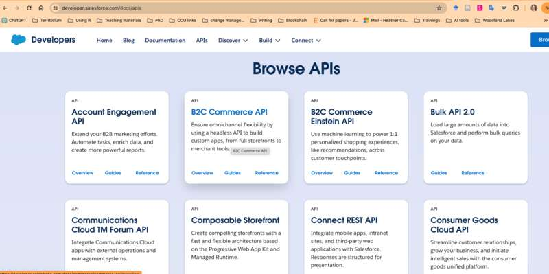

**How to measure:** Numerical value that counts the number of APIs made
available. Whole number from 0+. In the Salesforce example, each card is an API; look closely at the descriptions to see if it confirms it is an API.

**Code 1 if:**

- Documentation exists for REST, GraphQL, or External Worker APIs that
 allow developers to REQUEST data or perform actions

- Page is specifically about the platform\'s API for external
 developers (not internal integrations the company built with others)

- Registration/login page EXISTS for API/developer access (even if
 docs are behind the wall)

- Evidence includes: API reference pages, endpoint documentation,
 authentication guides for API access

**Code 0 if:**

- No API documentation found

- Only webhooks/event notifications exist (these are NOT APIs)

- Only mentions \"we integrate with X\" without developer-facing API
 docs

- Only deprecated APIs exist

**NOTE:** If a developer registration page exists (e.g., \"Sign up for
API access\", \"Create a developer account\"), code API=1 even if full documentation is behind the login wall.

**Do not count** deprecated APIs. Each endpoint is not another API. Each
API version does not count as another number; refer to variable AGE to count versions.

**DO NOT count**: individual endpoints, API versions (v1 vs v2 = same
API), webhooks, or auth flows

Additional variables to code for added detail:

**APIspecs** - Number of API specification languages

**APIspec\_list** - Which spec languages (RAML, OpenAPI, etc.)

### 4.3.2 API Endpoint (END) - DROPPED

**Dropped from analysis after sample test.**

**Definition:** Total count of distinct top-level API endpoint resources
across all platform APIs, including REST endpoints, GraphQL queries/mutations, and External Worker API endpoints.

**Location of the data:** Within the API documentation this should be
found under pages labeled \"Reference,\" \"API,\" \"REST API,\" \"Endpoints,\" or \"GraphQL Schema\". For simplicity, documentation on webhooks (which allow callbacks to realtime streaming services) should not be included in this count.

**Counting rules:**

1\. REST APIs: Count each top-level resource endpoint - Example: /customers, /charges, /refunds = 3 endpoints - Don\'t count: Sub-paths (/{id}, /{id}/sources), query parameters, or API versions

2\. GraphQL APIs: Count each query and mutation listed in schema - Example: ig\_hashtag\_search, ig\_hashtag, ig\_hashtag\_recent\_media = 3 endpoints

3\. External Worker APIs: Count distinct worker/job endpoints

4\. EXCLUDE: Webhooks, event notifications, deprecated endpoints, test/sandbox-only endpoints Rationale for exclusion: Webhooks are reactive/dependent resources that cannot be used independently to develop complementary applications.

**Range:** 0 to N (typically 10-100+ for major platforms)

**Keywords present:** Endpoint, reference, REST-API, GraphQL, schema,
queries, mutations, resource locator, URI

**Page indicators:** The page will clearly list a specific URI (uniform
resource locator) path that resembles a URL and that is labeled as an "endpoint."

**Example:** Meta GraphAPI Instagram Public Content Access lists 4
distinct query endpoints under \"Common Endpoints\" section → END = 4

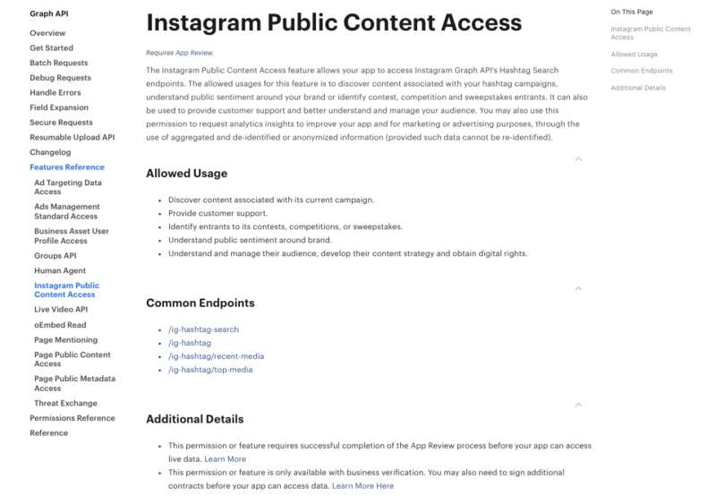

Additional variables to code for detail:

END\_pages -- the number of pages where endpoints are listed

### 

### 4.3.3 API Method (METH)

**Definition:** Count of distinct HTTP methods supported across all
platform APIs. Common methods include GET, POST, PUT, DELETE, and PATCH.

Method descriptions:

\- GET -- allows an application to retrieve data

\- POST -- allows an application to update data

\- PUT -- allows an application to create new data

\- DELETE -- allows an application to delete data

\- PATCH -- allows an application to update a part of the resource without re-sending an entirely new representation

**How to measure:** (Ordinal 0-2): API method capability level.

- **0** = No API documented OR no methods specified

- **1** = Read-only (GET/HEAD only)

- **2** = Full CRUD capability (includes any of: POST, PUT, PATCH,
 DELETE)

Code the HIGHEST capability observed. If any write method exists, code
2.

**Counting rules:**

1\. Identify HTTP methods documented eg: GET, POST, PUT, DELETE, PATCH, HEAD, OPTIONS

2\. If none, code as 0

3\. If only GET found, code as 1

4\. If more than GET is found (eg: also POST, PUT, DELETE), code as 2.

**Location of the data:** The same page that discusses the endpoints or
pages within 1 to 2 clicks on the navigation menu as listed. Keywords present: Get, Put, Post, Delete, Patch, Method, Create, Edit, Delete, HTTP

**Page indicators:** Look for the suggested common methods or those
formatted with an endpoint as noted in the example.

**Example:** In relation to the Instagram hashtag search endpoint, Meta
lists that a GET request can be used on the /ig\_hashtag\_search endpoint in conjunction with the user object used as a query parameter and identified as user\_id setting it equal to the user-id that is being queried.

Note: Response formats (JSON, XML, YAML) and data serialization methods are part of API architecture but are not counted in the METH variable, which focuses specifically on HTTP method variety.

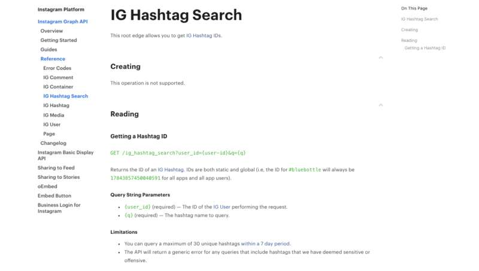

Additional variables to track for added detail:

**METH\_list** -- the list of which methods were found (GET,PST, PUT,
DELETE, etc.)

4.4 Developer Resource variables
--------------------------------

### 4.4.1 Developer portal (DEVP)

**Definition:** offering the possibility of registering and downloading
the SDKs and documentation; as well as provides a developer forum and contact information. Thus, the Developer Portal constitutes the means of accessing all other platform boundary resources.

**How to measure:** Binary indicator of whether a platform has a
dedicated developer portal.

**Coding rules:** 1 = Developer portal exists (dedicated page/site for
developers with BR access) 0 = No developer portal exists

**Location of the data:** Commonly on a page called
developers.COMPANYSITE.com or API.COMPANYSITE.com. May be linked off the main company webpage.

**Keywords present:** Developer site, Developer portal, API docs

**Page indicators:** This is not a singular page that talks about an
API, but the presentation of a full portal with other boundary resources present. Most commonly, API endpoints, documentation, registration, SDKs.

**Example:** <https://developers.facebook.com/?no_redirect=1> → DEVP = 1
(developer portal exists)

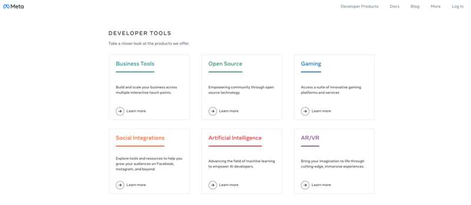

**How to measure:** Note: If a platform has multiple developer portals
for different API services (e.g., Salesforce presents multiple developer sites), code as 1 if at least one comprehensive portal exists. In coding notes, document the number and organization of portals, particularly how information is organized in alignment with the boundary resource classes and how information may be presented for multiple locations or languages.

**Range:** Binary (0 or 1)

### 4.4.2 Documentation (DOCS)

**Definition:** APIs are documented in the source code and the comments
are downloadable from the Developer Portal in HTML form and includes example programs and chunks of code. It will include: narrative, explanation of jargon or establishment of a common language of terms, syntax, details that facilitate semantic understanding or value propositions, descriptions of persona use cases, best practices, diagrams, illustrations, or sample code snippets (distinct from entire SDKs).

**How to measure:** Binary indicator of whether technical documentation
exists (1 = documentation exists, 0 = no documentation).

**Counting rules:**

Do NOT count documentation pages specifically about AI agent integration (code those in AI\_AGENT instead)

Only count:

\- General API documentation

\- Authentication guides

\- Getting started tutorials

\- Developer guides

Do NOT count:

\- Sub-pages within sections

\- Deprecated documentation

\- Version-specific docs (count current version only)

\- AI agent-specific documentation (goes to AI\_AGENT)

**Location of the data:** Developer portal, Docs, API Docs

**Keywords present:** Docs, Overview, Getting started, Quick Start,
Authentication, Rate limit, Use Cases, JSON, tutorial, blueprint, parameter, developer guide

**Page indicators:** The developer portal contains documentation that
explains the use cases of why and how to build an application on the API. Documentation pages are different than the endpoint pages and provide narrative discussion to support understanding of the value proposition or exactly how to build. In the case where the API information is sparse and it is mostly endpoints, it is expected that the pages on authentication, getting started, and testing might be the only documentation pages to record.

Special case: In the case where the developer portal it extensive, it is expected that endpoint pages will be in English and only the documentation pages or those related to governance may be those that are purposefully translated by the platform firm.

Count as: 0 or 1.

Example:

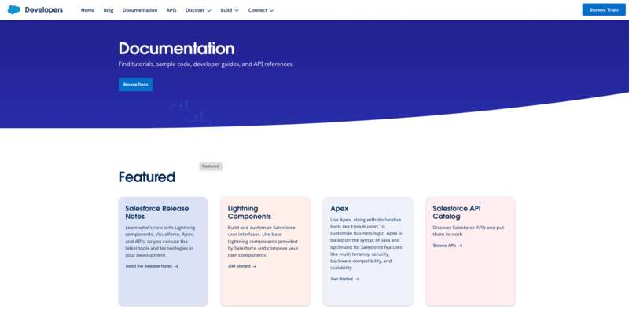

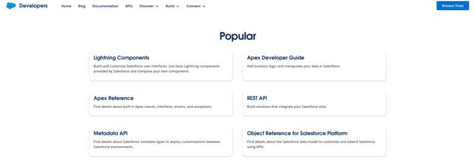

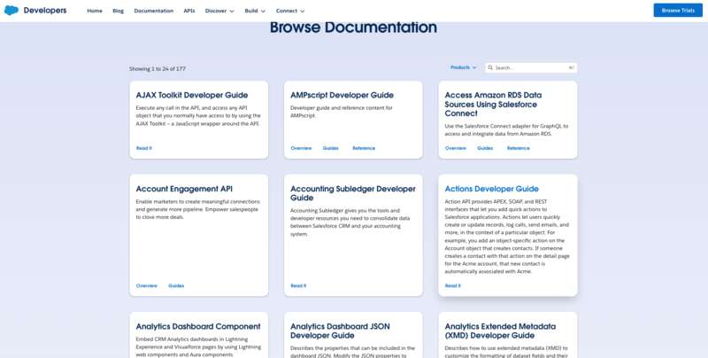

### 4.4.3 Software Development Kit (SDK)

**Definition:** "[a set of software tools](https://www.techtarget.com/whatis/definition/software-developers-kit-SDK)
and programs provided by hardware and software vendors that developers can use to build applications for specific platforms." Provides sample code or services to install into your application. SDKs can be available with sample code in different programming languages. Some definitions of SDKs incorporates specific APIs, Libraries, Documentation and debugging tools. For this analysis we are specifically looking for published libraries of code samples.

**Location of the data:** Within the developer site, in the github, or
in the docker

**Keywords present:** SDK, SDKs, software development kit, sample code,
code samples, snippet\*, toolkit

**Page indicators:** Links to SDKs are likely to be in the main menu.
Multiple different SDKs can be present especially if the platform has different product offerings or separates APIs for mobile or different frameworks or programming languages. These may be collected on one page or in different pages.

**Example:**

Salesforce SDKs available on its website

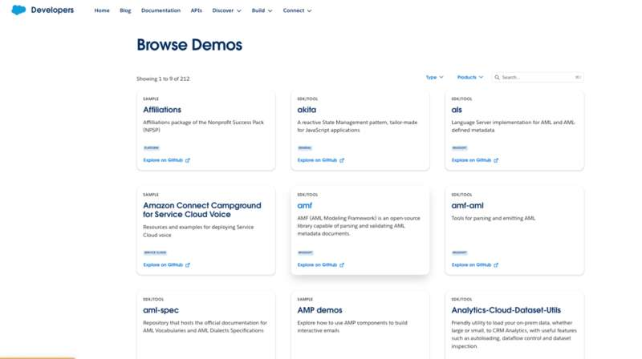

Examples of how SDKs may appear in the platform's Github (example from Velocity Network blockchain)

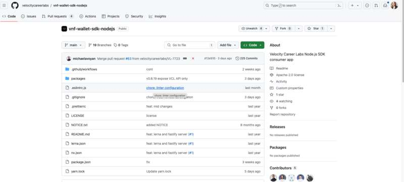

**How to measure:** Binary indicator of whether SDKs or client libraries
are available (1 = SDK exists, 0 = no SDK). The count of programming languages and specific SDK details are captured in SDK\_prog\_lang and SDK\_prog\_lang\_list. SDK refers to general-purpose client libraries for developers (Python, JavaScript, Java, etc.). AI-specific connectors (ChatGPT plugins, Claude MCP, Copilot) are coded in AI\_AGENT, not SDK. If a platform has separate APIs (e.g., Payments API, Identity API, Messaging API), each may have its own SDK

- Code 1 if ANY of: official SDK downloads, client libraries, code
 samples, starter templates

- **IMPORTANT**: If GIT=1 and the GitHub repo contains code samples or
 libraries, then SDK=1

- Look in: SDK section, Downloads, GitHub repos, \"Get Started\"
 sections

Count beta, preview, or experimental SDKs if they are publicly documented and downloadable. Do not count SDKs marked as \"deprecated\" or \"unsupported.\"

Only count official SDKs that are: - Published by the platform owner - OR officially endorsed and linked from the developer portal documentation Do not count third-party or community-maintained SDKs unless they are explicitly featured/endorsed in the official documentation.

Additional variables to code:

- **SDK\_lang** -- count of the number of different natural languages
 used on the pages or translations

- **SKD\_lang\_list** -- enumerate the list of natural languages,
 comma separated.

- **SDK\_prog\_lang** -- count of the umber of different programming
 languages used in the SDK.

- **SDK-prog\_lang\_list** -- enumerate the list of programming
 languages, comma separated.

### 4.4.4 Debugger tools (BUG)

**Definition:** (Binary 0/1): Debugging, testing, or quality assurance
tools provided to developers.

Debugger tools are made available in developer portals to test and debug code. Test systems may allow the developer to download error logs. Access to sandbox environments involve more resources and data access so they could require payment plans. Evidence of the need for payment to access a sandbox should be evidence in the public site.

**Location of the data:** API Developer portal, Documentation, a
separate testing suite, could be within a certification suite or a "sandbox" environment, or testing files could be included in the SDK, Github, or Docker. The platform may use interactive documentation tools, such as Apiary, to allow developers to try interacting with the API with sample calls.

**Keywords present:** \'sandbox\', \'test environment\', \'mock\',
\'debug\', \'profiler\', \'Postman\',

\'Docker\', \'test plan\', \'API console\', \'try it\', \'interactive\', \'playground\', \'emulator\', \'simulator\', \'error log\', \'inspector\'

**Page indicators:** Developer tools section, testing documentation,
getting started guides.

**How to measure:** this should be a binary calculation 0 if no tools
present and 1 if present.

Code 1 if the platform provides tools or environments for developers to test,

debug, or validate their integrations:

\- Sandbox or test environments

\- Mock data or test credentials

\- Interactive API consoles (try-it-out, API explorer)

\- Debugging tools (profilers, inspectors, log viewers)

\- Postman collections, Insomnia configs, or similar

\- Docker containers for local testing

\- Error simulators or test harnesses

\- CI/CD integration tools

Code 0 if:

\- Only error code documentation exists (listing HTTP 400/500 errors is DOCS, not BUG)

\- Only troubleshooting FAQ pages exist without actual tools

\- Only \"known issues\" lists without testing tools

Additional variables to code:

- **BUG\_types** -list the types of debugger tools available; comma
 separated

- **UG\_prog\_lang\_list** -- list the types of programming languages
 found in debugger tools, if identified; comma separated

**Example:**

Apiary service

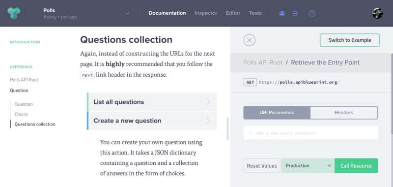

Example of Testing services that can be built into API documentation if using Postman Teams to build the API:

And running tests

### 4.4.5 Standards & Interoperability (STAN)

**Definition:** Third-party interoperability standards adopted by the
platform.

- The platform uses or develops public technical standards that allow
 for common understandings of how technical systems should interact, how data should be formatted, and guidance on implementation.

- We are interested in whether there are specific third-party
 protocols used for interoperability of features --- NOT merely adherence to the basic standards to transact with the API.

Common standards organizations:

\- IETF (Internet Engineering Task Force) --- publishes RFCs (Requests for Comment) for internet protocols

\- W3C (World Wide Web Consortium) --- web/mobile standards including encryption, blockchain, verifiable credentials, payments, accessibility

\- ISO (International Organization for Standardization) --- quality, safety, IT security

\- IEEE --- engineering standards in energy, aerospace, IT, communications

\- Khronos Group --- graphics and compute standards (Vulkan, OpenGL, OpenXR, OpenCL)

**Location of the data:** Developer Portal documentation

**Keywords present:** \'internet protocol\', \'internet standard\',
\'industry standard\', \'IETF\', \'ISO\', \'RFC\', \'IEEE\', \'W3C\', \'Khronos\', \'OAuth\', \'OpenID\', \'Vulkan\', \'OpenGL\', \'OpenXR\', \'TWAIN\', \'WebRTC\', \'SAML\', \'FIDO\', \'specification\', \'compliance\'

**Page indicators:** Developer portal documentation, API docs, GitHub
repos. Look for standards organization abbreviations with their specific name or number of a related standard.

**How to measure:** (Binary 0/1)

\- Examples that COUNT as STAN=1:

\- OAuth / OAuth 2.0 (IETF RFC 6749)

\- OpenID Connect (OIDC)

\- Vulkan, OpenGL, OpenXR, OpenCL (Khronos Group)

\- TWAIN (scanner/imaging standard)

\- WebRTC, WebSocket protocols (W3C/IETF)

\- SAML, SCIM (identity standards)

\- FIDO/WebAuthn (authentication standards)

\- ISO financial services standards, ISO 27001 security

\- Any named IETF RFC, W3C Recommendation, ISO standard, or IEEE standard that is foundational to the application being developed

Do NOT count the follwoing as STAN (basic API transaction standards):

- REST, SOAP, GraphQL (expected API styles)

- HTTP/HTTPS, JSON, JSON-LD, XML, HTML, CSS (basic web formats)

- TLS/SSL (basic transport security)

- UTF-8 or character encoding

- Basic app authentication patterns unless they reference a specific
 RFC or standard by name

CRITICAL: The mention should be foundational to the application that is to be developed and not merely adherence to the basic standards to transact with the API. --

Additional variables to code:

- **STAN\_list** - Standards found, semicolon-separated.

**Example:**

IBM's payment services refer to use of ISO financial services standards

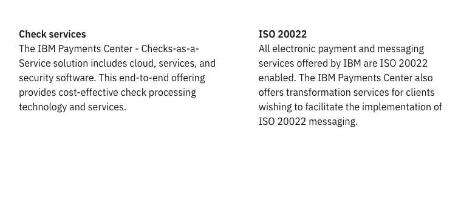

Oracle example

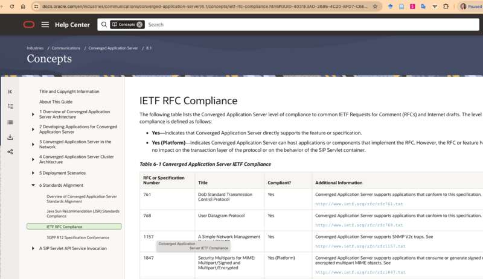

4.5 AI Resource variables
-------------------------

### 4.5.1 AI Model Access & APIs (AI\_MODEL)

**Definition:** Programmatic access to AI/ML models that perform tasks
such as text generation, embeddings, vision analysis, or model tuning. The resource gives developers access to an AI capability, not just a regular API.

**Location of the data:** Developer Portal documentation

**Keywords present:** "AI model," "large language model (LLM),"
"embedding API," "inference endpoint," "text generation," "image generation," "fine-tuning," "model-as-a-service," "machine learning model," "AI API."

**Page indicators:** Sections or navigation items labeled **"AI API,"
"Model endpoints," "Embeddings," "LLM access," "AI services,"** or documentation pages showing code snippets for calling model endpoints. Presence of API keys or rate limits specific to AI models also indicates this category.

**Example:** *"Developers can call our text-generation endpoint using
the AI Inference API to generate content in real time."*\ (OpenAI API Documentation:
[[https://platform.openai.com/docs]{.underline}](https://platform.openai.com/docs)
)

**How to measure:** Binary coding 0 = No programmatic access to AI/ML
models available 1 = Programmatic access to AI/ML models available through API Code as 1 if the developer portal provides API endpoints specifically for calling AI/ML models (e.g., text generation, embeddings, image generation, speech recognition). Do not code as 1 if the platform only uses AI internally without exposing model access to developers.

Additional variable to code:

- **AI\_MODEL\_types** -- list the types of AI models used ie: LLM,
 embedding, vision, etc.; comma separated

### 4.5.2 AI Agent & Assistant Integrations (AI\_AGENT)

**Definition:** Platform enables external AI assistants, agents, or
copilots (e.g., ChatGPT, Copilot, Claude, Gemini) to connect to and execute platform functions or workflows. The platform acts as a "tool" within an AI agent's reasoning process. AI uses the platform.

**Location of the data:** Developer Portal documentation

**Keywords present:** "ChatGPT plugin," "Copilot integration," "AI
assistant," "AI action," "tool schema," "MCP server," "register your app," "assistant connector," "agent framework," "AI actions API."

**Page indicators:** Pages describing how to **register or connect a
platform to an external AI assistant** (e.g., ChatGPT, Gemini, Claude). Often found under "Integrations," "Assistant tools," or "Developer Apps SDK." Presence of JSON schema definitions, "function calling," or "tool registration" code blocks indicates this category. This focuses on **how external assistants connect and call platform functions**, i.e. *agent invocation.*

**Example:** *"Add your service to ChatGPT using the OpenAI Apps SDK and
make your API accessible as a ChatGPT tool."*\ (OpenAI Apps SDK:
[https://openai.com/index/introducing-apps-in-chatgpt](https://openai.com/index/introducing-apps-in-chatgpt?utm_source=chatgpt.com))

**How to measure:** Binary coding. Code as 1 if the developer portal
indicates that the platform supports integration with external AI assistants, agents, or copilots (e.g., ChatGPT plugins, Claude MCP servers, Microsoft Copilot extensions, custom GPTs, AI agent frameworks).

Key indicators include:

- Pages describing how to register or connect a platform to an
 external AI assistant

- Presence of JSON schema definitions for AI function calling

- \"AI assistant connector,\" \"plugin,\" or \"agent integration\"
 terminology

- Tool/function registration endpoints specifically for AI agents

- References to AI assistant platforms (ChatGPT, Claude, Copilot,
 etc.)

DISTINCTION FROM OTHER VARIABLES:

- Do NOT double-count in DOCS: If there is documentation about agent
 integration, code AI\_AGENT=1 but do NOT count these pages in DOCS. Only count general API documentation in DOCS.

- Do NOT double-count in SDK: If there is an SDK/library specifically
 for agent integration (e.g., \"ChatGPT Plugin SDK\"), code AI\_AGENT=1 but do NOT count this in SDK. Only count general development SDKs in SDK variable.

Code AI\_AGENT based on the CAPABILITY to integrate with external AI agents, regardless of whether there is documentation or SDK support. The presence of agent integration features is what matters for this variable. Code as 0 if the platform only provides its own AI features (code those in AI\_MODEL) without allowing external AI agents to integrate.

Additional variables to code:

**AI\_AGENT\_platforms** -- list of which agent platforms are listed
(ie: ChatGPT, Claude, Copilot, etc.); comma separated

### 4.5.3 AI-Assisted Development (AI\_ASSIST)

**Definition:** Developer productivity tools that use AI to help build
or debug code, not general SDKs. These include copilots, AI code completion, or prompt-based code generation tools directly targeting developer experience. A Developer uses AI.

**How to measure:** Binary coding

0 = No AI-assisted development tools available

1 = AI-assisted development tools available

Code as 1 if the developer portal provides:

\- AI code completion or suggestion tools

\- AI-powered debugging assistants

\- AI pair programming features

\- IDE/editor plugins with AI assistance

\- Prompt-to-code generation capabilities

Examples of tools that count: GitHub Copilot, Cursor AI, Tabnine, Codeium,

AI-powered debugging features

Do NOT count:

\- General AI model APIs (those go in AI\_MODEL)

\- Documentation generated by AI (if not interactive coding tool)

\- AI agents that execute code (those go in AI\_AGENT)

**Location of the data:** Developer Portal documentation

**Keywords present:** "AI-assisted coding," "AI pair programmer," "code
completion," "Copilot," "vibe coding," "prompt-to-code," "AI debugging," "AI developer assistant," "intelligent autocomplete."

**Page indicators:** Developer portal pages or tool descriptions
emphasizing **AI support inside IDEs, CLIs, or editors**. Look for references to VS Code, JetBrains, terminal commands, or setup guides for copilots and code assistants. Tutorials or screenshots showing inline code suggestions or chat-based code generation are strong indicators.

**Example:** *"GitHub Copilot uses generative AI to suggest whole lines
or functions as you type in your IDE."*\ (GitHub Copilot: <https://github.com/features/copilot>)

Additional variables to code:

**AI\_ASSIST\_tools** -- list the kinds of tools offered (ie: VS Code,
JetBrains, terminal commands, or setup guides for copilots, etc.); comma separated

### 4.5.4 AI Context & Data Exposure AI\_DATA

**Definition:** The platform provides structured interfaces that expose
internal data/models to AI systems (not to humans directly). Enables AI models to "see" contextual data through protocols like MCP or GraphQL designed for AI retrieval.

**How to measure:** Binary coding

0 = No structured data exposure for AI systems

1 = Structured data exposure for AI systems available

Code as 1 if the developer portal provides:

\- Model Context Protocol (MCP) servers

\- Dedicated AI data access endpoints

\- Semantic APIs designed for AI consumption

\- Graph schemas for AI querying

\- Structured metadata exposure for AI agents

\- Context layers specifically for LLMs

Key distinction: This measures data exposed TO AI systems for their use,

not data FROM AI systems for human use.

Examples that count:

\- Figma MCP server for design data

\- Notion MCP server for workspace data

\- Semantic knowledge graphs for AI

\- Structured context APIs for agents

Do NOT count:

\- Regular REST APIs (even if AI could use them)

\- APIs that return AI-generated content (those go in AI\_MODEL)

**Location of the data:** Developer Portal documentation

**Keywords present:** "Model Context Protocol (MCP)," "context server,"
"AI-readable data," "semantic API," "graph schema," "structured data for AI," "AI context layer," "contextual retrieval," "LLM access to data."

**Page indicators:** Developer pages describing **how AI systems or
agents can access structured data** through dedicated endpoints or context protocols. Often appears under "Data APIs," "AI Context Server," or "Knowledge Layer" documentation. Mention of metadata exposure or integration with AI agents via protocols (e.g., MCP) signals this category. This focuses on **how internal data or knowledge is made available to AI systems**, i.e. *data exposure*

**Example:** *"Our Model Context Protocol server allows AI assistants to
query design objects, text labels, and metadata directly from the design file."*\ (Figma MCP Server:
[https://www.theverge.com/news/679439/figma-dev-mode-mcp-server-beta-release](https://www.theverge.com/news/679439/figma-dev-mode-mcp-server-beta-release?utm_source=chatgpt.com))

Additional variables to code:

**AI\_DATA\_protocols** -- list the specific AI protocols used (i.e.:
MCP, GraphQL, etc.); comma separated

### 4.5.5 AI Extensions & Marketplaces (AI\_MKT)

**Definition:** The platform operates a distribution environment for AI
models, agents, or plugins built by third-party developers. This includes marketplaces, model hubs, or plugin stores specifically listing AI assets.

**How to measure:** Binary coding

0 = No AI extension marketplace exists

1 = AI extension marketplace exists

Code as 1 if the platform operates:

\- AI model hub/marketplace

\- AI plugin store

\- AI agent marketplace

\- Custom GPT store

\- AI extension gallery

\- Platform for distributing AI assets built by third parties

Key indicators:

\- Browse/search interface for AI assets

\- Submission/publishing process for developers

\- Monetization or distribution of AI models/plugins

\- Curation or approval process for AI extensions

Examples that count:

\- Hugging Face Model Hub

\- OpenAI GPT Store

\- ChatGPT Plugin Store

\- Anthropic Model Marketplace

Do NOT count:

\- General app marketplaces (those go in STORE unless AI-specific)

\- Internal AI tools (must be third-party marketplace)

\- Links to external AI services (must be platform-hosted marketplace)

**Location of the data:** Developer Portal documentation

**Keywords present:** "AI marketplace," "model hub," "plugin store,"
"agent store," "AI extension," "AI add-on," "publish model," "monetize your plugin," "submit your model," "AI skill catalog."

**Page indicators:** Top-level menu or developer documentation referring
to a **marketplace, gallery, or hub** where developers can upload, distribute, or monetize AI models, extensions, or agents. Look for submission guidelines, publishing APIs, or terms of monetization.

**Example:** *"Explore, share, and deploy thousands of open-source AI
models through the Hugging Face Model Hub."*\ (Hugging Face: <https://huggingface.co/models>)

Additional variables to code:

- **AI\_MKT\_type** -- list the type of marketplace offered (ie: model
 hub, plugin store, etc.); comma separated.

4.6 Governance Resource variables
---------------------------------

### 4.6.1 Roles (ROLE)

**Definition:** specifies who has access and decision rights about
access to the application or functions. The documentation should mention specific responsibilities or decision makers in authenticating applications, obtaining access to API keys, or transmitting data. For example, the documentation might specify that a user account needs a different role with access permissions before it is authenticated to the API to perform the application function (e.g.: A Facebook page requires a user with the role of "administrator" authenticate to your application before a function such as posting content to the page can be performed via your application. Instead if the app just needed to view the page, that may be done without an admin account because it is already public and that action does not involve transforming any data.)

**How to measure:** This is a binary value. 1 = a distinction in user or
developer roles exist, 0 = there is no mention.

> **Operational Rule --- OAuth:** If the platform uses OAuth and its
> documentation mentions different scopes or permissions (even
> implicitly through the OAuth flow), code ROLE=1. OAuth inherently
> involves scoped access rights, which constitutes role-based access
> differentiation. Do NOT code ROLE=0 simply because the platform uses
> "simple OAuth" --- if scopes exist, ROLE=1.
>
> **Code 1 if ANY of the following are present:** - Different
> user/developer roles (admin, viewer, tester, etc.) - OAuth with scoped
> access or permissions - Tiered authentication levels (e.g., basic
> vs. full access keys) - Access control documentation describing who
> can do what
>
> **Code 0 if:** - Only a single generic developer account type exists
> with no differentiation - Generic user account settings (profile,
> notifications) with no role distinctions - "Sandbox vs production"
> access levels (those relate to OPEN, not ROLE)

**Location of the data:** Documentation, pages that discuss set up or
access or authentication.

**Keywords present:** roles, administrator role, access, people with
access, user with access, access API key, authentication, user account

**Page indicators:** The set-up page will indicate how an application
needs to be build and how to obtain authorization to perform functions on the API. The set up or access pages may discuss authentication via Oath or use of an API key. The documentation may have other pages specific to roles and permissions.

**Example:**

Facebook describes user roles that need permissions that are invoked when the app authenticates to perform an action.

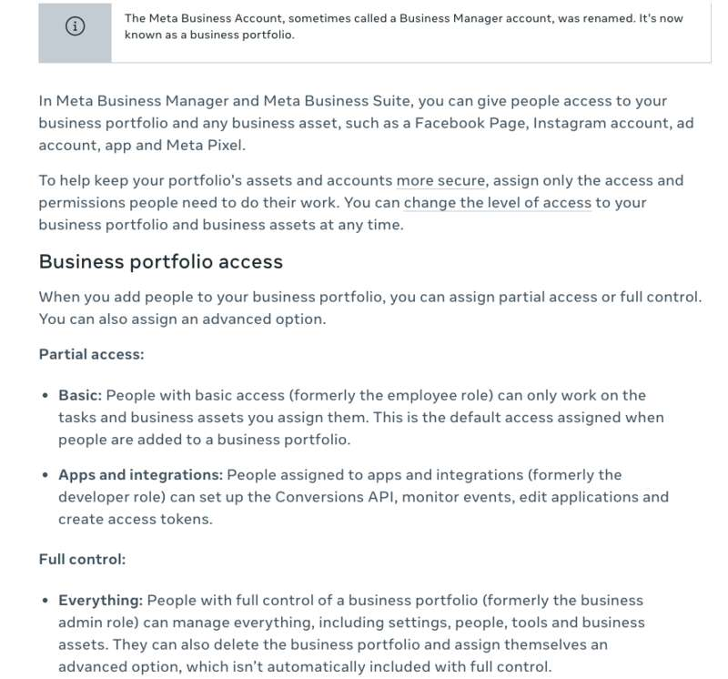

Moneylion API requires use of different bearer tokens to access the API, not specific roles that may restrict functions or access.

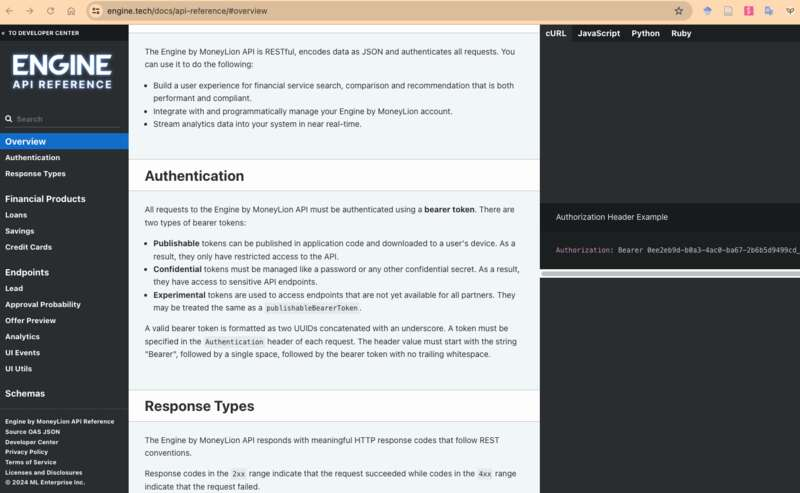

### 4.6.2 Data (DATA)

**Definition:** (Binary 0/1): Data policies or agreements governing
developer use of platform data.

**Location of the data:** Terms of use page, governance or usage
guidelines, developer documentation

**Keywords present:** \'data governance\', \'data policy\', \'developer
data\', \'user data\',

\'data privacy\', \'first party data\', \'third party data\', \'GDPR\', \'CCPA\',

\'data owner\', \'data provider\', \'data consumer\', \'data controller\',

\'data processor\', \'data classification\', \'data retention\'

**Page indicators:** A page will indicate "terms and polices" or "Data
policies" or "Data usage." Because of GDPR regulations, it is expected that any terms of use agreement will contain some mention related to data privacy. Instead, this analysis should look for detailed pages in the developer documentation to make data usage restrictions or obligations more apparent in how apps should be designed.

**How to measure:** This is a binary value, 1= if specific rules on data
usage policies exist, 0 if they do not exist.

> **Code 1 if** the platform provides ANY document --- whether a
> standalone data policy page, a Developer Agreement, API Terms of Use,
> or Terms of Service --- that specifies how developers should handle,
> store, or process data obtained through the platform's APIs or SDKs.
> The terms do NOT need to be on a dedicated "Data Policy" page; data
> governance clauses embedded within a broader agreement count.
>
> **Code 0 if:** - Only a generic corporate/consumer privacy policy
> exists that addresses end users but makes NO mention of developer or
> API data usage - No terms governing developer data handling can be
> found anywhere in the portal
>
> **Important:** Most developer portals with APIs will have some form of
> Terms of Use or Developer Agreement that governs data usage. If you
> find ANY such document that specifies how developers should handle
> data obtained through the API, code DATA=1.

Additional variables:

- **DATA\_lang** -- count of number of languages in which data
 policies exist (translations of the page)

- **DATA\_lang\_list** -- list of the natural languages, comma
 separated

Observations about the policies can be noted in coding\_notes.

**Example:**

Meta provides detailed pages with an overview on what developers must agree to when they sign up for access but also more extensive detail on other data control issues such as data scrapping (automated data collection) or managing user privacy. It also lists enforcement actions and how the app will be reviewed.

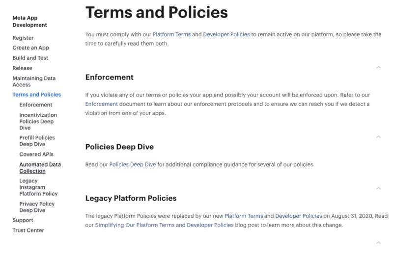

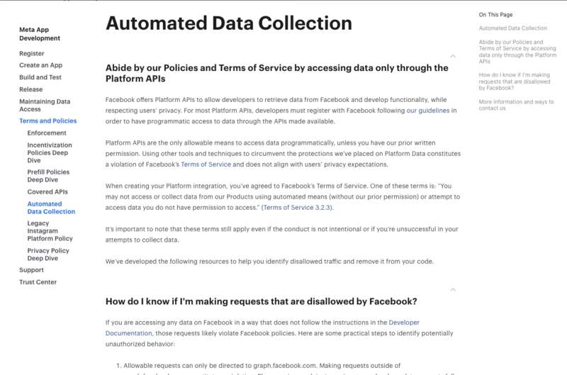

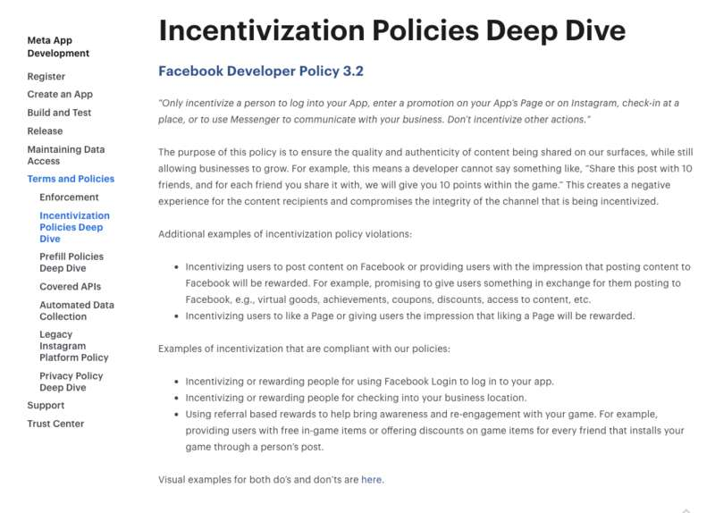

### 4.6.3 Marketplace/App Store (STORE)

**Definition:** Allows a complementor to publish their offering in a
public directory to be found by consumers. App stores may have a fee or generate revenue. They require an approval process for listing.

**Location of the data:** Look for a specific page that lists an app
store or app marketplace on the main public page or in the developer portal.

**Keywords present:** App store, Marketplace, App Marketplace,
Integrations, App review, App approval

**Page indicators:** The main site will advertise their integrations or
an app marketplace to end consumers or buyers to show the robustness of the platform. Also, look for instructions in the developer portal about how to get your app listed in the marketplace including whether there is an approval process.

**Example:**

Microsoft Azure marketplace

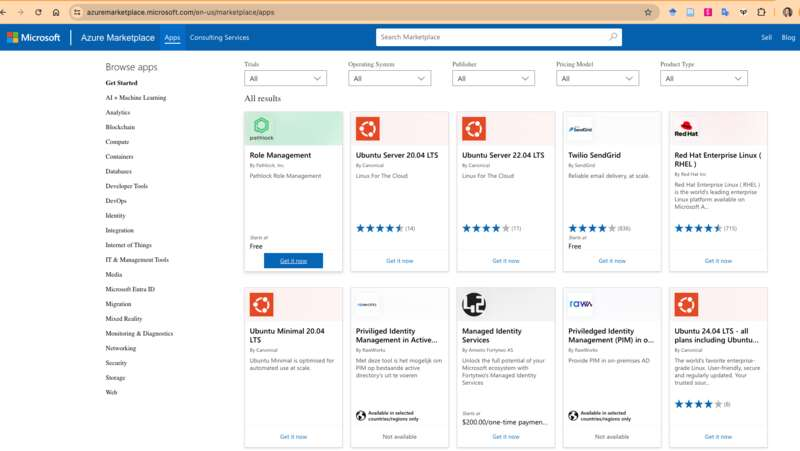

**How to measure:**

If app can be listed in a marketplace = 1

If no public marketplace exists = 0

Additional variables to code:

- **STORE\_lang** -- count of natural languages used on pages in the
 app store or app marketplace. These may or may not be translations as marketplaces might be local to a region or country.

- **STORE\_lang\_list** -- list the natural languages found, comma
 separated

List any unique observations in coding\_notes

### 4.6.4 Registration of the App/Certification (CERT)

**Definition:** This process may also have requirements that when the
developer has completed building the application that they go through some sort of certification test by interacting with a test suite, or perhaps submitting some type of success log. If there is an app store there may be a submission and approval process.

**Location of the data:** In the developer site or a certification suite
may have its own part of the developer site.

**Keywords present:** Register your app, Apply for Access, Release your
app, Certify, Certification,

**Page indicators:** pages may be labeled as "Register your app" or
"Apply for access." To find out if the process includes a concluding step to approve the application through some sort of test or certification, look for a set of stepped instructions on how to build the app that indicates you need to complete a certification.

**Example:**

How 1Edtech, which certifies education technology companies on its standards, displays information with a guide to certification and a designated certification suite for developers to complete a test.

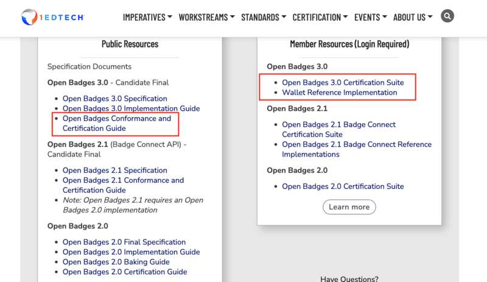

The platform may then publish a director of apps that have passed certifications.

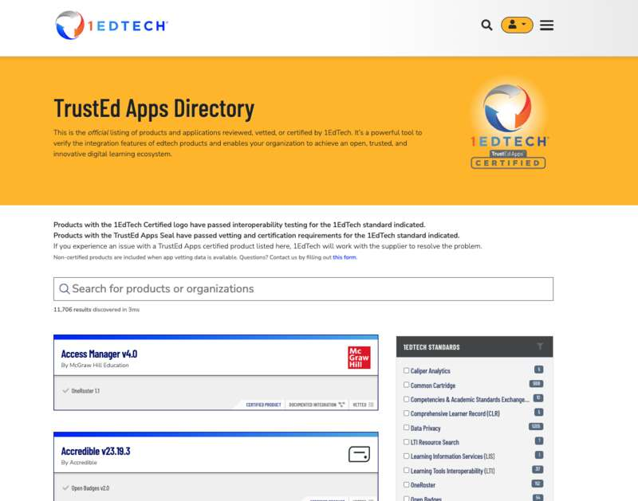

Meta has a procedure to submit for app approval.

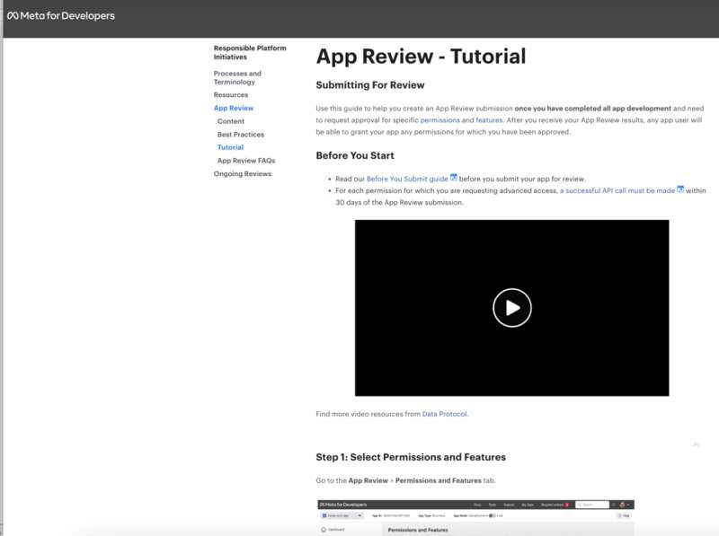

Zapier lists how to get published in the app directory.

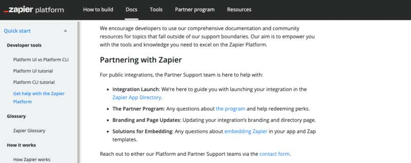

**How to measure:** This is a binary measure, if there is any type of
approval or certification process = 1, if there is none =0.

Additional variables to code:

- **CERT\_lang** -- count of the number of languages found for
 translated pages related to certification programs.

- **CERT\_lang\_list** -- list the languages found, comma separated

Note any unique observations in coding\_notes

\*note for analysis\* CERT and STORE should be reviewed for correlation to see if they should be a joined measure.

### 4.6.5 Open Access (OPEN) - DROPPED

**Dropped from analysis after sample tests.**

**Definition:** Determines if access to the platform is open or has a
payment model. May address intellectual property rights.

**Location of the data:** On the developer site or a Partners/
Partnerships page

**Keywords present:** Register, Get access, Create an account AND
(pricing OR contract)

(A simple agreement to terms of service does NOT count as restricted access).

**Page indicators:** The developer portal indicates that the access to
the API is open and free. A page called partners might describe how to become a developer and if a contract or payment is required. Or on the developer site, page elements may be restricted behind a sign-up process that indicates a contract or pricing terms are required.

**How to measure:** If payment or contract terms are required = closed.
If no restriction needed with a negotiated contract or payment then = open.

Closed = 0

Open = 1

**Critical distinctions included:**

- Free registration with no payment = OPEN=1

- Free tier with rate limits + paid tier = OPEN=1

- Free sandbox + paid production = OPEN=1

- Must pay or contact sales for ANY access = OPEN=0

- Portal behind partner program or NDA = OPEN=0

- If the portal is entirely behind a login wall, application process,
 or the scraper returned no usable content, code OPEN=0 (assume restricted until evidence of free access is found).

- Do NOT default to OPEN=0 when no content is available

- DO NOT default to OPEN=0 when unsure

> **Clarification on "approval":** The key distinction between OPEN=0
> and OPEN=1 is self-service vs. gatekept access: - **OPEN=1:**
> Developer signs up and gets access automatically, even if they must
> verify their email or agree to terms. Automated/instant approval
> processes count as free registration. - **OPEN=0:** Developer must
> APPLY and WAIT for a manual/human review before getting access (e.g.,
> "apply for access," "request developer credentials," staff review,
> waitlist).

Additional variables to code:

- **OPEN\_lang** -- count of natural languages where translations of
 this page exist.

- **OPEN\_lang\_list** -- list the languages found, comma separated.

**Example:**

OpenAI's API access to Chat GPT lists pricing terms. The page also indicates payment requirements for each LLM

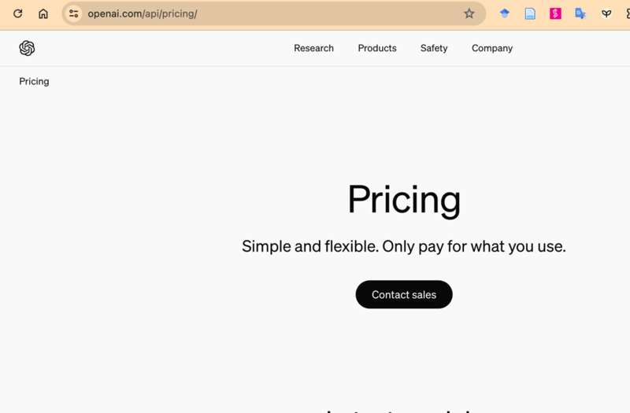

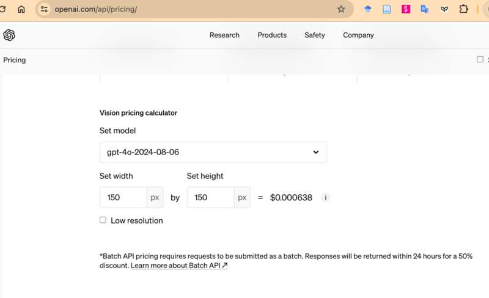

Intel displays a "partially open" developer site with different level of developer access with enhanced levels that require a company agreement

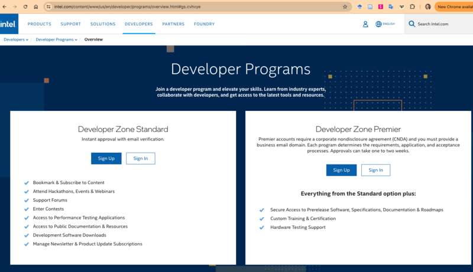

4.7 Social Resource variables
-----------------------------

### 4.7.1 Multiple communications channels (COM)

**Definition:** Multiple communication channels (Forum/ Live Chat/
Support/ help desk/ co-innovation space/ social media/ blogs). Enables the third-party developers to interact with each other and with the platform owner. Help pages or contact information may be available.

**Location of the data:** Forum or help desks or references to other
communications tools may be available within the developer site or in Github.

**Keywords present:** Forum, Chat, Slack, Discord, Community, Community
Resources, Discussion, Issues, Pull requests, Help, Knowledge Base, FAQ, Support, Customer Support, Facebook, Twitter, YouTube, StackOverflow, Blog, Tutorial

**Page indicators:** The developer site may advertise a Slack channel or
Discord group. It may embed a forum or forums/issues boards/pull requests may be used in github.

**Example:**

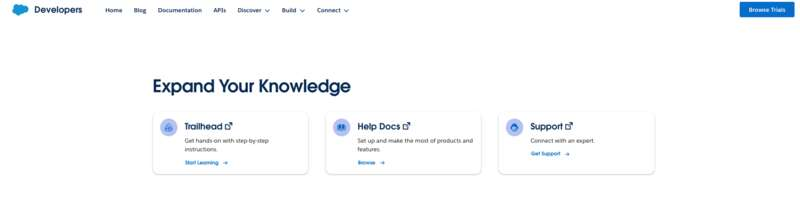

Github example of communication between developers regarding changes in the documentation

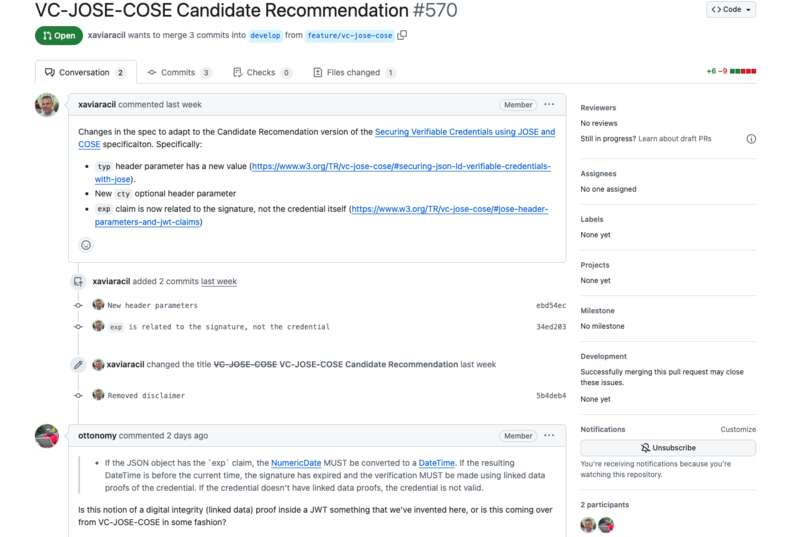

Github example of reporting issues and commenting about the topic

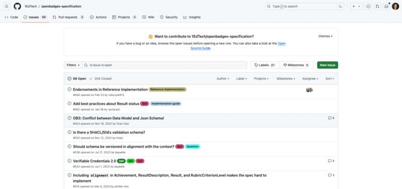

Oracle example

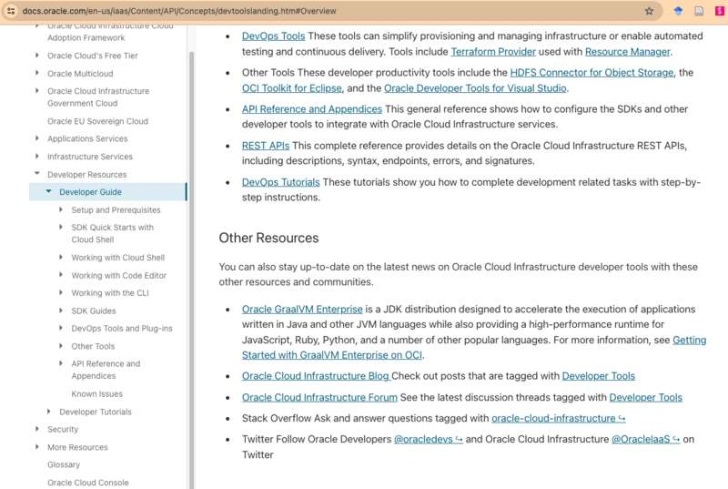

Google advertisers their social media accounts for developers

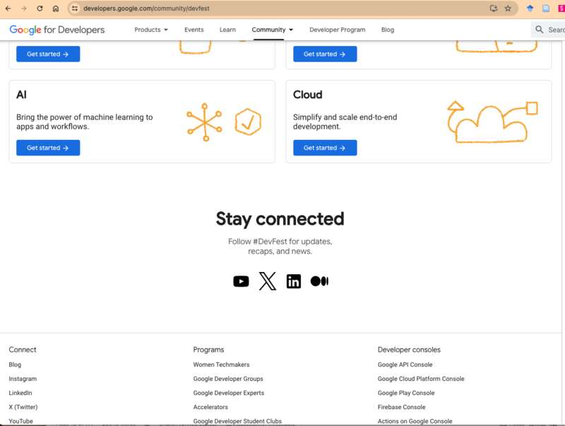

Zapier's help center discusses how it can provide help (Note: this page references limited debugging capabilities but not dedicated support for debugging. This page can be used to code both COM resources and BUG resources.)

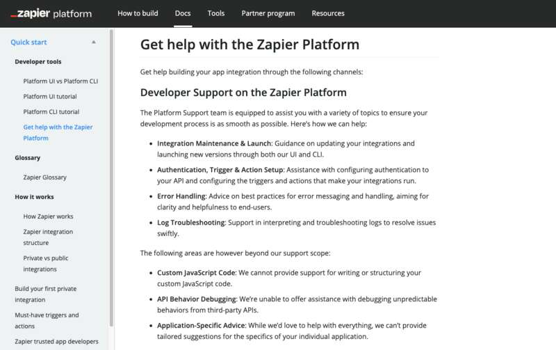

**How to measure:** Binary counts of types of COM resources. If the
platform uses Slack, a forum, a blog, and a help desk the number would be 4. **DO NOT COUNT THE GITHUB HERE because it is already recorded in the item "GIT"; only review the Github for other community interaction features like active discussion boards, codespaces, collaboration via public repos, reviewer requests, pull requests.** Because of the overlap in github utility for publishing documentation, SDKs, and forums, it may need to be controlled differently in the analysis of data.

Code these sub variables and they will total the COM score:

- **COM\_social\_media** -- 0 If FALSE/ 1 if TRUE - if social media
 accounts are found specifically for developers to communicate. Look for accounts accessible on developer pages. Keywords: \"Twitter\", \"X\", \"LinkedIn\", \"YouTube\", \"developer blog\", \"dev community\" in social media context. Look for social media icons or links in the header or footer of the developer portal.

- **COM\_forum** -- 0 If FALSE/ 1 if TRUE - if a developer forum
 discrete from GitHub is provided with threaded discussions. Keywords: \"forum\", \"community forum\", \"discussion board\", \"developer community\", \"discussions\", \"ask a question\". NOT just a contact form or support ticket system. Note: forum and community pages may also contain links to Discord, Slack, or other chat platforms --- check these pages when coding COM\_Discord and COM\_Slack.

- **COM\_blog** -- 0 If FALSE/ 1 if TRUE - if a blog specifically for
 developer information, platform changes, or release notes is present with multiple dated posts. Keywords: \"blog\", \"dev blog\", \"engineering blog\", \"news\", \"announcements\", \"changelog\", \"what\'s new\", \"release notes\". Must have multiple posts or articles, not just a single page.

- **COM\_help\_support** -- 0 If FALSE/ 1 if TRUE - if help or support
 pages are offered with customer service information. Keywords: \"help\", \"support\", \"help center\", \"support center\", \"contact us\", \"get help\", \"submit a ticket\", \"knowledge base\". Includes ticket systems, email support, phone support. Do NOT code 1 just because an FAQ exists --- COM\_FAQ is a separate variable\" to the prompt should fix it for the full batch run.

- **COM\_live\_chat** -- 0 If FALSE/ 1 if TRUE - if customer service
 pages contain a live chat feature. This could include an AI bot that launches alongside any page. Keywords: \"live chat\", \"chat with us\", \"chat now\". Look for: chat widget, Intercom, Zendesk chat, Drift, or AI chatbot popup. Must be real-time chat, not just a contact form.

- **COM\_Slack** -- 0 If FALSE/ 1 if TRUE - if a Slack channel is
 offered for developers to communicate with platform staff or each other. Keywords: \"Slack\", \"Join our Slack\", \"slack.com\". Look for slack.com links or Slack community invitations. Also check forum, community, and GitHub pages where these links are often posted.

- **COM\_Discord** -- 0 If FALSE/ 1 if TRUE - if a Discord channel is
 offered for developers to communicate with platform staff or each other. Keywords: \"Discord\", \"Join our Discord\", \"discord.gg\". Look for discord.gg links or Discord community invitations. Also check forum, community, and GitHub pages where these links are often posted.

- **COM\_stackoverflow** -- 0 If FALSE/ 1 if TRUE - if
 StackOverflow\'s knowledge sharing platform is used or linked to from the dev portal. Keywords: \"StackOverflow\", \"Stack Overflow\", \"stackoverflow.com\". Look for StackOverflow tags or direct links.

- **COM\_training** -- 0 If FALSE/ 1 if TRUE - if the developer portal
 offers dedicated learning resources for developers. This includes recorded or on-demand training courses, academies, coding tutorials, and how-to walkthroughs that teach developers to build with the platform. Keywords: \"training\", \"academy\", \"tutorial\", \"course\", \"learn\", \"how-to\", \"walkthrough\". Do NOT count standard API/SDK reference documentation or getting started pages. Do NOT count live webinars here (those are coded under EVENT\_webinars). Do NOT count certification programs (those are coded under CERT).

- **COM\_FAQ** -- 0 If FALSE/ 1 if TRUE - if the dev portal has a
 frequently asked questions section either in a help section or elsewhere. Keywords: \"FAQ\", \"frequently asked questions\", \"common questions\", \"Q&A\".

Note: COM\_tutorial and COM\_other dropped after sample test, unreliable

In the columns for different types of communications options on the list above, record a 1 if it is found, and 0 if it is not found. The COM value should total to the total number of these items found.

Other variables not in COM count that should be captured:

- **COM\_lang** -- count of number of natural languages present on
 pages with COM resources

- **COM\_lang\_list** -- list of the natural languages found, comma
 separated

NOTE: Refer to the most recent Stackoverflow survey for other popular asynchronous tools, dev tools, IDEs etc for other tools to look for

<https://survey.stackoverflow.co/2024/technology#most-popular-technologies-ai-search-dev>

### 4.7.2 Github (GIT)

**Definition:** a code sharing platform that allows for the distribution
of libraries, SDKs, documentation, discussion, issue reporting, and contribution of add on services from developers.

**Location of the data:** On the developer site a link to "Github"

**Keywords present:** Git, Github

**Page indicators:** On the developer site the documentation, SDK or
other resources page may link to their Github.

**Example:**

Meta's developer portal section for building apps in Messenger references their Github on their Getting Started/ Quick Start guides to encourage developers to access started code

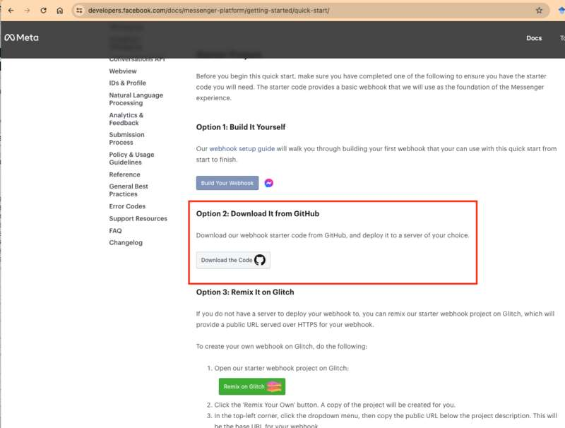

We can see Meta manages a Github called fbsamples

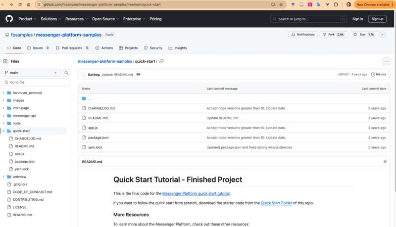

Going to the fbsamples main page lets us see the other repositories they publish and in what languages. This example shows their most popular repos are published code from their f8 events, for messenger, for video playback, livestreaming, and other open source projects from the community.

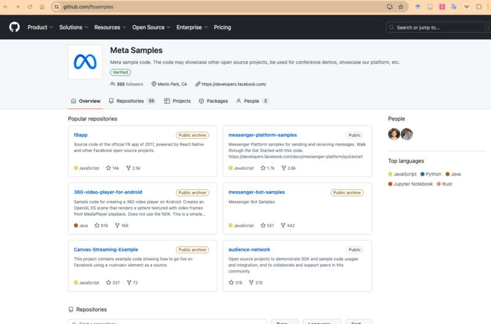

Other repos can be browsed as well.

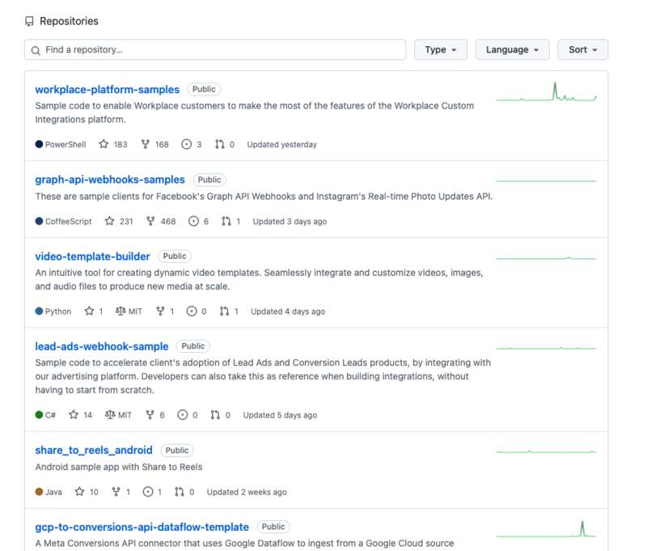

Programming languages in these repos can also be sorted.

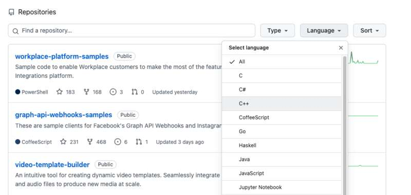

**How to measure:**

Count the number of dedicated Github accounts that the platform manages, if detectible, otherwise 1 if there is an account and 0 if not.

Count which languages the Git has resources available.

Count which spoken/written languages are used in the Github or if only English is used.

Evaluate if the Git is used just to publish SDK/code samples or if discussion forums and pull requests are present. (If so, go to the COM variable and record it).

**Coding GIT\_prog\_lang from the GitHub organization page:** When
coding GIT\_prog\_lang, count the programming languages visible on the company\'s main GitHub organization page (e.g., github.com/LEGO). This includes:

1. The **\"Top languages\" bar** displayed near the top of the organization page

2. The **language tag** shown on each individual repository as you scroll down the main page

For example, visiting github.com/LEGO shows top languages including TypeScript, JavaScript, Shell, Lua, and HTML near the top of the page, and scrolling the repository list reveals additional languages such as C\# and Scala tagged on individual repos.

Count all unique programming languages visible from these two sources on the main page. Do not click into individual repositories to check their full language breakdowns --- only count what is visible from the main organization landing page. If the platform links to a specific repository rather than an organization page, count the languages listed on that repository\'s main page.

For AI-coded platforms, a \"GITHUB REPOSITORY LANGUAGES\" section has been injected into the COMBINED\_CONTENT.txt file containing the equivalent information (top languages bar and per-repo language tags) that a human would see on the GitHub organization page.

Additional variables to code:

- **GIT\_url** -- list the URL found to the github site found on the
 page

- **GIT\_lang** -- count of the number of natural languages available.
 See example from Meta above where language list if available on the right rail of the gitlab page on main hub site.

- **GIT\_lang\_list** -- list the names of the natural languages
 found, comma separated

- **GIT\_prog\_lang** -- count of the number of programming languages
 found on the GitHub organization main page (from the top languages bar and individual repo language tags). See example above in Repositories, language filter shows programming languages in which repos are available.

- **GIT\_prog\_lang\_list** - list the programming languages, comma
 separated

A programming language markdown file is provided to the AI coder and available in Github.

### 4.7.3 Monetization tools/ Reward systems (MON)

**Definition:** (Binary 0/1): Monetization or revenue-sharing programs
for developers.

This allows the complementor to enhance revenue with ways to earn money from functions in the application or through growing subscribers.

**Location of the data:** Partner pages, monetization section, developer
programs, marketplace terms

**Keywords present:** \'monetization\', \'monetize\', \'revenue share\',
\'earn\', \'payout\',

\'partner program\', \'affiliate\', \'royalty\', \'developer fund\', \'incentive\',

\'marketplace earnings\', \'commission\'

**Page indicators:** the page will discuss a plan where the app
developer can earn revenue and what are the eligibility rules and terms to receive payments.

**How to measure:** This is a binary value, if monetization programs
exist = 1, if they do not exist = 0.

Code 1 if the platform offers programs where developers can earn money or

receive financial benefits:

\- Revenue sharing (ad revenue, in-app purchase splits, royalty programs)

\- Developer monetization programs (earn from content, apps, or integrations)

\- Partner programs with explicit financial tiers or incentive structures

\- Affiliate or referral programs with developer payouts

\- Marketplace where developers sell apps/plugins and receive revenue

Code 0 if:

\- Only a generic partner program exists without financial benefits mentioned

\- The platform sells to developers but does not pay developers

\- Free tier or credits offered (that is OPEN, not MON)

\- Partnership is about co-marketing without revenue sharing

> **Clarification:** MON is about developers EARNING money FROM the
> platform, not about developers PAYING the platform. Paid API tiers or
> pricing pages where developers pay for access are NOT MON=1 (those
> relate to OPEN). MON=1 requires evidence that the platform has a
> mechanism for developers to receive financial benefits (revenue
> sharing, marketplace payouts, developer funds, bounties, affiliate
> commissions).

**Example:**

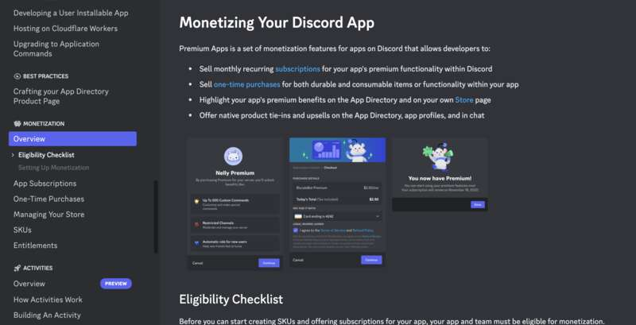

Google positions way to earn money from apps

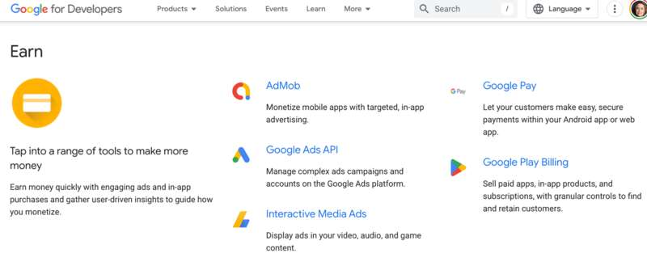

Zapier positions this as a "partner" program and instead of earning direct cash, developers are incentivized to grow their integration to get enhanced support, leads to sell new services, and inclusion in co-marketing programs

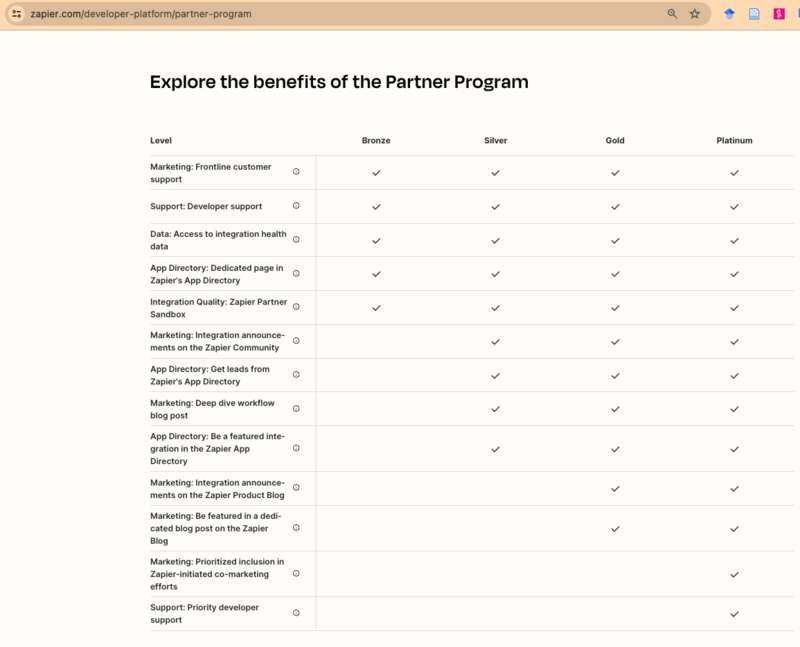

Zapier provides a dashboard available to calculate ongoing metrics and tier eligibility

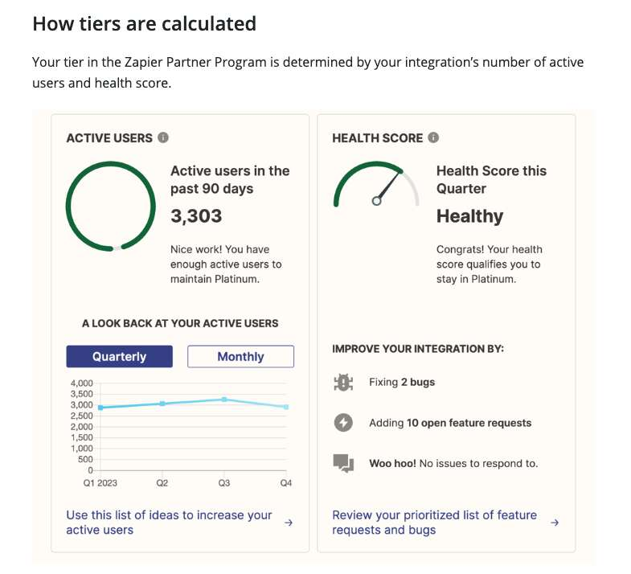

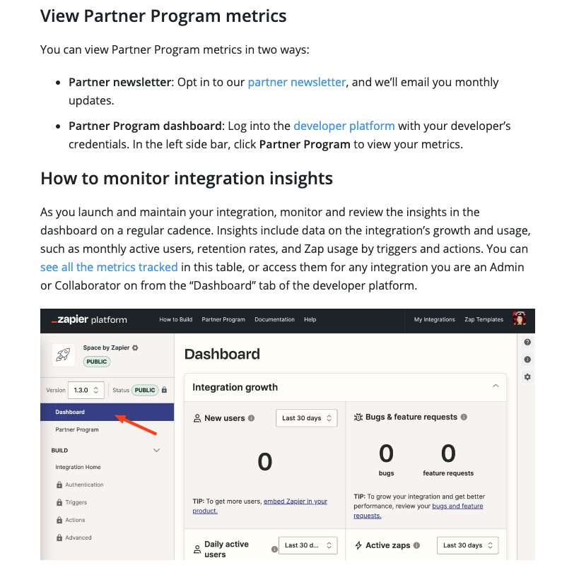

### 4.7.4 Programs/events/hackathon/ meet ups (EVENT)

**Definition:** events transfer knowledge in a privileged and structured
way between the participating developers and the keystone player.

**Location of the data:** in the developer site

**Keywords present:** Events, Virtual Event, Webinar, Zoom session,
Hackathon, Conference (or a named event with CON like DevCON, Twitter has "Flight", Facebook has F8 (virtual) or Meta Connect (in person) )

**Page indicators:** An events page will exist with a list of events or
may have sub-categories for different types of events (Webinar, conferences etc.). Forums may advertise these events.

**Example:**

Cisco has an events menu in the developer portal

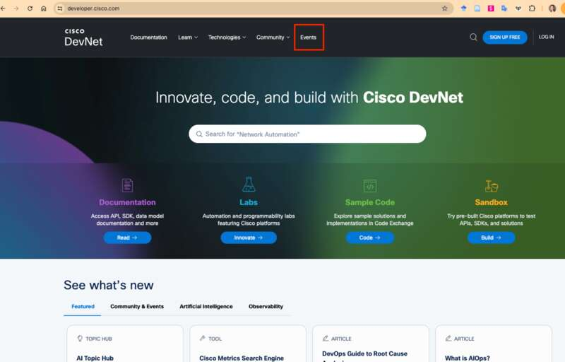

Cisco events list contests, social media events, virtual events, etc.

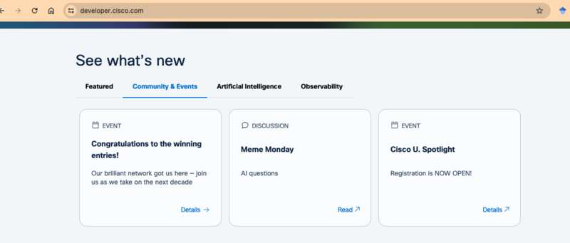

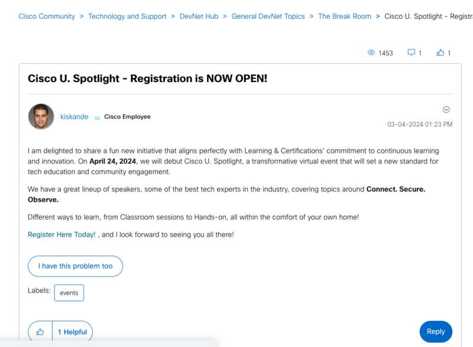

Intel lists upcoming events, webinars and hackathons

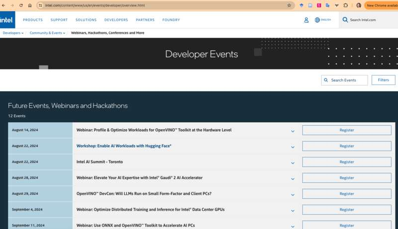

Main page of Salesforce developer site lists AI NOW event tour.

The AI Now event lists in person locations in India, UK, Canada, Netherlands, and the USA as well as virtual events.

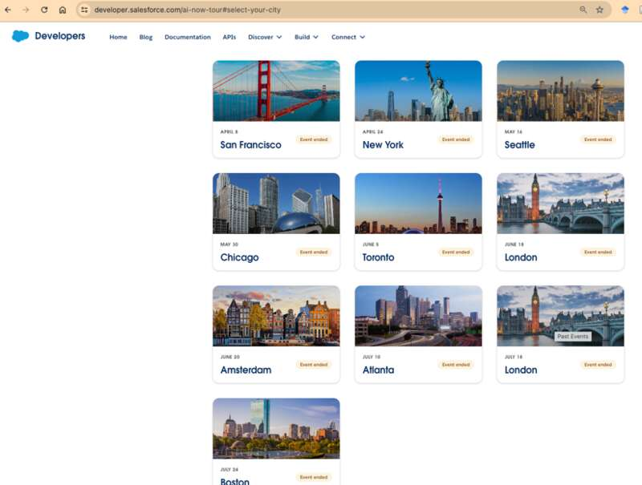

Google has a DevFest conference:

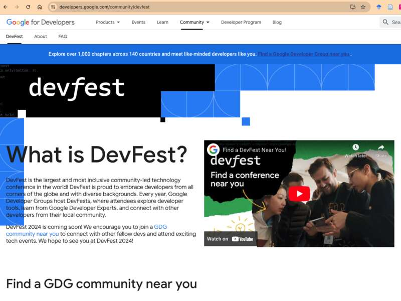

**How to measure:** Record whether these types of events exist (1 =
true, 0 = false) in these additional variable fields:

- **EVENT\_webinars** --the platform offers regular webinars about API
 functionality, new features, etc. Webinars are live informational events, different than training sessions. See examples above.

- **EVENT\_virtual** --the platform offer virtual events. Rather than
 a discrete and one-way information share of a webinar, a virtual event allows the developer community to connect with each other. These may be large Zoom meetings. Often "virtual" will be in the title of the event. See examples above.

- **EVENT\_in\_person** -- the platform offers in-person events. These
 may be regional events, meet ups, meetings at various industry conferences. See examples above such as Salesforce AI Now Tour or Intel developer events list.

- **EVENT\_conference** -- the platform offers an annual developer
 conference like Google's DevFest. This is not the general sales kick off like Salesforce's Dreamforce, unless it is clear from the dev portal that there are specific developer tracks at the larger platform conference for non-developers.

- **EVENT\_hackathon**- the platform offers inperson or online
 hackathon events to build apps.

**EVENT** variable is calculated as a sum total off EVENT\_webinar +
EVENT\_virtual + EVENT\_in\_person + EVENT\_conference + EVENT\_hackathon. List the sum in the EVENT variable field.

Additional variable:

- **EVENT\_Other** -- note if some other type of event exists that
 cannot be coded in the other variables and what it is, for human to review and revise the EVENT counts. Be specific on the new event type found.

- **EVENT\_countries** -- note Comments in what countries in person
 events take place, comma separated.

### 4.7.5 Boundary spanner roles (SPAN)

**Definition:** individuals who serve to manage ecosystem partners and
address local or cultural divides.

**Location of the data:** Partners pages, Developer site, Developer
Community sites

**Keywords present:** Experts, Account manager, program manager,
dedicated resources, community program

**Page indicators:** individual people or job roles are mentioned either
for external or internal individuals.

**Example:**

In its StartUp Program, Twilio makes dedicated technical account managers available to help in addition to paid customer support plans.

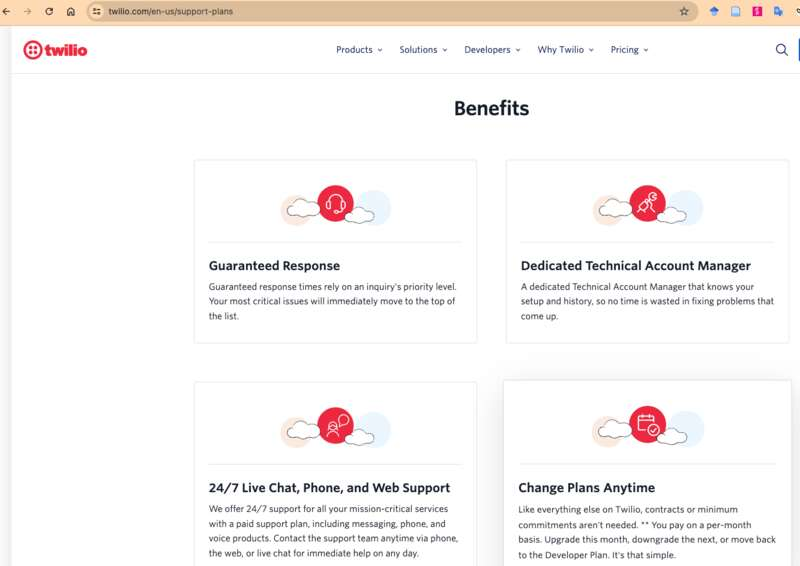

Google provides a community that allows individuals to apply to be an "expert" to assist others in the community and obtain different levels of expert status.

Google also features some of these individuals as available to help with questions.

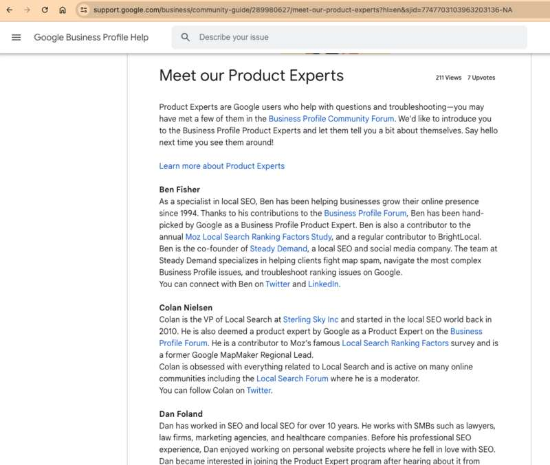

These people answer directly in the forums. This post also shows specific programs such as a StartUps program which is managed by Google, like Twilio.

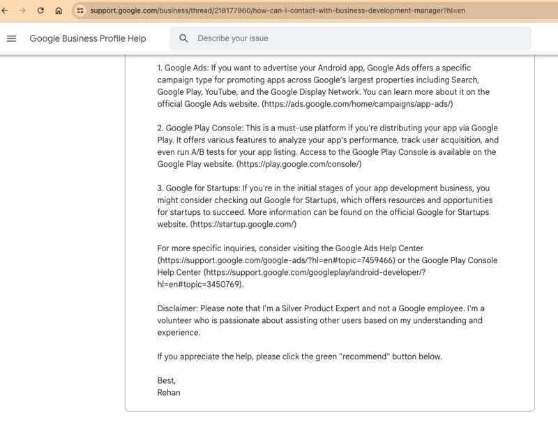

As part of its community Google also has different resource programs and groups Ie; for students, women, accelerators etc.

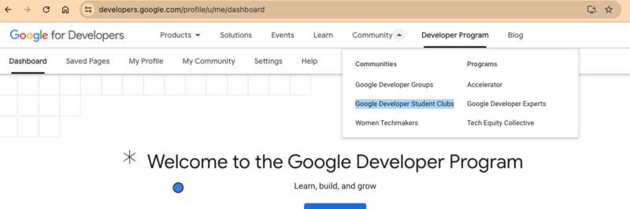

These communities are regionally organized so developers can find resources closer to them.

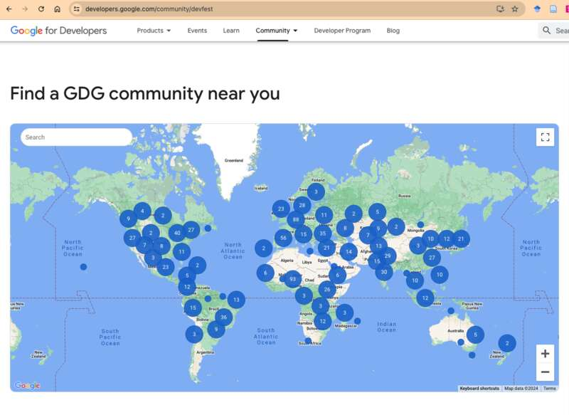

**How to measure:** measure the different levels of commitment to
resources made available for people to connect to advance the developer community.

Record whether these types of boundary spanners exist (1 = true, 0 = false) in these additional variable fields:

- **SPAN\_internal** -- platform deploys internal experts/staff
 (either paid or free) to work with developers

- **SPAN\_communities** -- the platform has organized communities or
 community groups (ie: Student Ambassadors, Women in Tech, local communities) that allow developers to support each other. This is not the same as a forum. Groups of communities might use multiple communication tools, or have various events. This variable is to code if dedicated communities exist.

- **SPAN\_external** -- the platform recruits external subject matter
 experts and their points of view or knowledge are evangelized. See example above in Google Product Experts.

The **SPAN** variable is a SUM of these 3 variables.

Additional variables to code:

- **SPAN\_lang** -- count of natural languages used in pages about
 boundary spanners

- **SPAN\_lang\_list** -- list the natural languages, comma separated

- **SPAN\_countries** -- list the countries in which these spanners
 exist.

4.9 Language variables
----------------------

*Collecting languages:*

As you review the documentation for each sample you will also look for evidence of the documentation in other languages and capture the number of languages present and the list of languages used.

Control for location:

If possible, use a browser like Opera with built in VPN turned on. Settings include blocking sites from seeing location, ad blocker, blocking third party cookies, secure DNS to block sharing of prior browsing history. Did not limit to secure DNS/https only in case some sites do not have that enabled.

How to check site:

- Check the USA / .com site first. Look for evidence of the API.

- Then look for listing of other country pages -- in the footer, in
 the navigation, on a drop down with a country or language abbreviation in the header.

- Record these options and record if the same site to the API appears
 on these other versions of the company's website.

The same exercise will be completed to determine programming language variability however that will be limited to the documentation, Github, SDK and Debugger tools.

Cells for calculation are provided in the excel collection sheet as described below.

Upon completing the coding review all of the columns where different languages have been noted.

### 4.9.1 Linguistic Varity (linguistic\_variety)

**Description:** Count of distinct natural languages available in the
developer documentation

**Data type:** Numeric

**Example:** 5 (if platform supports English, Spanish, German, Japanese,
Chinese)

### 4.9.2 Linguistic Variety list (linguistic\_variety\_list)

**Description:** List of natural languages supported when the count for
linguistic\_Variety is obtained.

**Data type:** Text (semicolon-separated)

**Example:** \"English; Spanish; German; Japanese; Chinese\"

### 4.9.3 Programming Language Variety (programming\_lang\_variety)

**Description:** Count of distinct programming languages found
documented in the developer site or Github. Refer to an example index in the codebook.

**Data type:** Numeric

**Example:** 7 (if platform has SDKs for Python, Java, JavaScript, Ruby,
Go, PHP, .NET)

**Hot to measure:**

To determine programming languages that are supported by the platform, the software development kit (SDK) or Github/Docker/Postman repositories will be reviewed as they normally aggregate and label packages of code for each software language.

Example: Discord

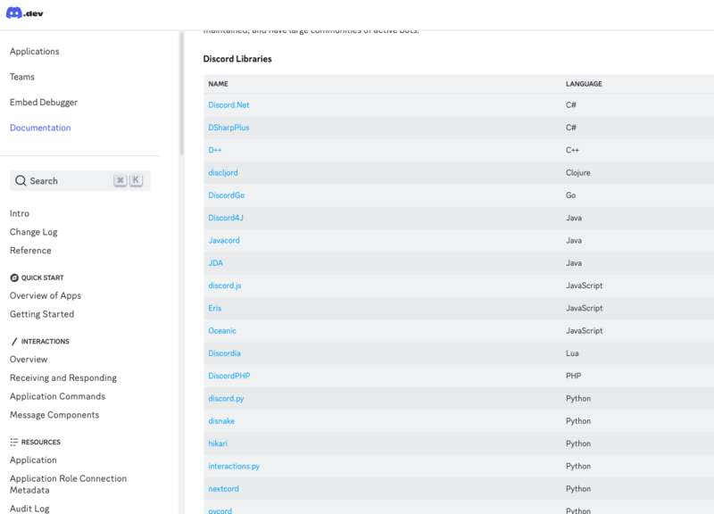

It is possible that the platform may intentionally use multiple languages together and not independently. Polyglot programming is the practice of using multiple programming languages to leverage the strength of each language for different tasks. Notebooks, similar to SDKs but that mix executable code, visualizations, equations, and narrative text, may be published so these should be investigated to see if there is presence of a polyglot strategy. These have been popularized in the use of Jupyter notebooks for python. Microsoft has released a
["Polyglot Notebook" extension for Visual Studio Code (VS Code)](https://code.visualstudio.com/docs/languages/polyglot) and is
powered by .NET Interactive. If this is present in the developer site, the presence of the notebook can be coded together with the SDK but not what languages are used, if possible, to note them together with the list of programming languages. Make a special note if the presence of a polyglot strategy is detected so this can be captured as a data point.

Example: Discord

Example: Twilio

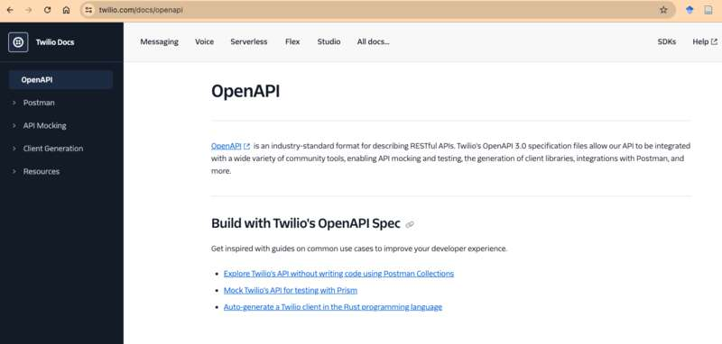

### 4.9.4 Programming Language Variety list (programming\_lang\_variety\_list)

**Description:** \"List of programming languages supported when
programming\_lang\_variety is coded.

**Data type:** Text (semicolon-separated)

**Example:** \"Python; Java; JavaScript; Ruby; Go; PHP; .NET\"

### 4.9.5 Home Primary Language (home\_primary\_lang)

**Description:** \"Primary language of home country\"

**Data type:** Text

**Example:** \"English\" (for US-based platform)

Note the primary language of the home country in PRIM\_lang (as referenced by Ethnologue) and indexed in the code book. This does not come from manual coding or web scraping, but the data index linked in the excel sheet CODEBOOK.xlsx

### 4.9.6 Language notes (language\_notes)

**Description:** Notes about language observations that are recorded to
help clarify any coding.

**Data type:** Text

**Example:** \"Full docs in EN/ES/DE; SDK docs only EN/ES; Support only
EN\"

5. Platform Metadata 
====================

5.1 Platform (PLAT)
-------------------

To produce a data set that controls for endogeneity, the full industry list from Euromonitor must be contained on the code book Excel sheet that is aggregating the data and the Platform (PLAT) variable should keep track of whether that company was found to have a platform or not.

In some cases, the presence of a platform may be found but the information may be restricted behind a paywall or login, preventing the data from being scraped.

This field should be coded as:

- PUBLIC = Publicly accessible, no login required

- REGISTRATION = Requires free account/registration

- RESTRICTED = Requires approval/NDA/partner program

- NONE = No developer portal exists

5.2 PLAT\_notes
---------------

Detail notes about the coding of the platform related to why the coder chose the PLAT coding value. For example "Required free Microsoft account" or "Behind paywall."

5.3 Industry (IND)
------------------

Euromonitor Passport database in the UNCG library, existing categorization of industries. This is a string/text value.

Example: Video Game

5.5 Industry ID (IND\_ID) 
-------------------------

Use an identifier for each industry that is a 2 letter abbreviation.

Example: Video Game = VG

6. Platform-level Control variables
===================================

THIS ITEM WAS DROPPED FROM ANALYSIS DUE TO CODING ISSUES.

6.1 Age of the platform (AGE) - DROPPED
---------------------------------------

**Did not produce enough data to continue to measure in the full
model.**

**Measure as:** the number of versions of the API or SDK. If both are
available, use the oldest.

**Page location:** In the API documentation it may be visible at the top
of the main page or in the footer where the API is named with a version (v) and a number ie: APIv1.1. The API version or a version of the SDK may also be listed in code samples or within the format of the URI. Versions may also be on a change log.

Example: Facebook's GraphQL API

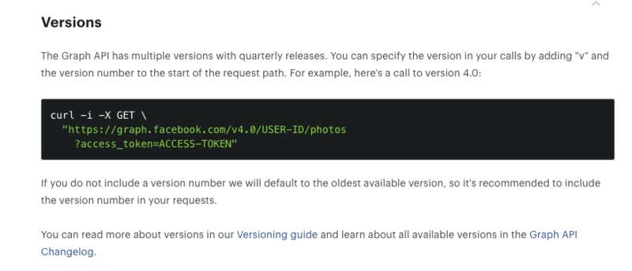

Other things to note:

Note how often the firm does releases and how stable the versioning is. "Stable versioning" involved consistent changes to the versioning over time, for example the API may release a new version every year or every few years with incremental branches as updates are made (Main version APIv1; same year branch for new addition APIv1.1; same year branch for errata updates, APIv1.1a; same year branch for another addition APIv1.2; next year new version with major changes in functionality is APIv2.0)

6.2 API Year (API\_Year) - DROPPED
----------------------------------

THIS ITEM WAS DROPPED FROM ANALYSIS DUE TO CODING ISSUES.

**Measure as:** This is date value represented by the date the first
version of the API was published.

**Page location:** On the page where you find AGE value, you may find
the first date associated with the first version of the API. This could be present in a blog post, on a footer or copyright, or in the text of the page. A secondary location could be news releases on the company website or developer portal that indicate the year the company launched an API to support their platform.

6.3 Industry growth (IND\_GROW)
-------------------------------

From the Euromonitor Passport database in the UNCG library, select Industry from the search bar. Select industries and then access market share reports. This will provide market shares by country in currency. Convert the currency to USD fixed exchange rates.

Use Convert data. Access Growth data. Use Year-on-year growth % to obtain the percent change between each year period. Use growth index to normalize the set to 100 at the beginning of period and use the change to 2024to obtain overall growth number. A 5 year growth percent can be downloaded by selecting Period Growth.

Download both sets. Use Period Growth as the primary measure and supplement with YOY if time analysis is needed.

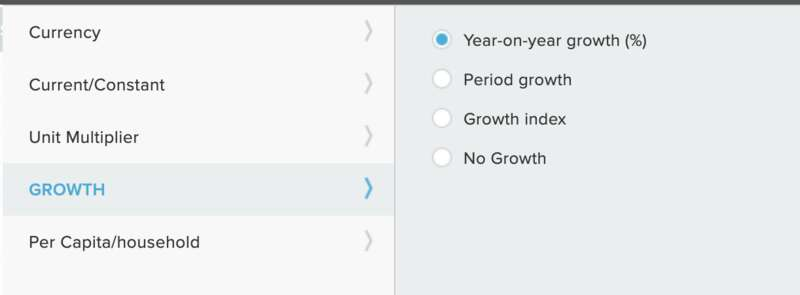

7. Home Country Control Variables
=================================

7.1 GDP Per Capita
------------------

Obtain GDP Per Capita data from World Bank data base of World Development Indicators (WDI) for the host market. The WDI data will be loaded from an R library directly in the analysis code.

- Controls for **home country wealth/development**

- Wealthier countries → more resources for platform development

- Affects both boundary resource investment AND ecosystem development

- Standard control in international business research

**Variables:** these will be coded in variables
**home\_gdp\_per\_capita** and **host\_gdp\_per\_capita** from an index
of World Development Index data matched with the country ISO codes.

Compared the list of countries to the country dyad pairs for the Video Game industry and 2024 was found to include all the necessary countries except Taiwan. World Bank does not include Taiwan due to political issues.

IMF data was looked up for Taiwan data and manually entered into the R code. Sources:

1. IMF DataMapper (direct source): <https://www.imf.org/external/datamapper/NGDPD@WEO/OEMDC/ADVEC/WEOWORLD/TWN>

2. IMF Taiwan Country Profile: <https://www.imf.org/external/datamapper/profile/TWN>

3. IMF World Economic Outlook Database (October 2024): <https://www.imf.org/en/publications/weo/weo-database/2024/october>

**Data Summary (2024):**

- **218 countries** total (including Taiwan placeholder)

- **192 countries** with GDP data

- **217 countries** with Population data

- **Data year: 2024**

Manual verification was done using the data set here
[https://databank.worldbank.org/source/world-development-indicators\#](https://databank.worldbank.org/source/world-development-indicators)

**List of Countries Missing GDP (14):** American Samoa, British Virgin
Islands, Cuba, Eritrea, Gibraltar, Guam, Isle of Man, North Korea, Northern Mariana Islands, South Sudan, Saint Martin (French part), Syria, U.S. Virgin Islands, Yemen.

In analysis, use: Log-transform to address skewness in the R code:

> *R code:*
>
> *data\$log\_gdp\_per\_capita <- log(data\$gdp\_per\_capita)*

7.2 Internet users
------------------

Obtain internet users data from World Bank data base of World Development Indicators (WDI) for the host market. The WDI data will be loaded from an R library directly in the analysis code.

- **Digital infrastructure** affects platform adoption

- More internet users → larger potential complementor pool

- Directly relevant to digital platform ecosystems

- Controls for \"digital divide\" between countries

**Variables:** these will be coded in variables
**home\_internet\_users** and **host\_internet\_users** from an index of
World Development Index data matched with the country ISO codes.

7.3 Population
--------------

The population of the country derived from World Bank data of World Development Indicators (WDI). Helps control for market attractiveness. The WDI data will be loaded from an R library directly in the analysis code.

**Variables:** these will be coded in variables **home\_population** and
**host\_population** from an index of World Development Index data
matched with the country ISO codes.

**Countries Missing GDP (14):** American Samoa, British Virgin Islands,
Cuba, Eritrea, Gibraltar, Guam, Isle of Man, North Korea, Northern Mariana Islands, South Sudan, Saint Martin (French part), Syria, U.S. Virgin Islands, Yemen

7.4 English Proficiency
-----------------------

To be used as an additional control if necessary with language variables.

Definition: The English language proficiency ranking of countries in the Education First "EF English Proficiency Index"

Values are scored in five categories:

**Proficiency Level**: Five categories

- Very High (600-800)

- High (550-599)

- Moderate (500-549)

- Low (450-499)

- Very Low (below 450)

The full English proficiency score range of current index values is from 390 to 624.

The index is published at <https://a.storyblok.com/f/287853162362820/x/98a6001fc9/ef-epi-2025-english.pdf> Claude.AI was used to extract the PDF values and add them as an index for application to the host country dyad as a control.

**Variables:** These will be coded in **home\_ef\_epi\_score** and
**host\_ef\_epi\_rank** to match the home and host countries according
to the ISO code.

8. Moderator - Cultural\_distance
=================================

Hofstede dimensions culture data for six dimensions of culture as presented in Cultures and Organizations 3rd edition 2010 and last updated in 2015 values published at:

<https://geerthofstede.com/research-and-vsm/dimension-data-matrix/>

Join index of each of the 4 main culture variables into the data set via R and compute the Kogut-Sing Cultural Distance score for each home-host country dyad.

9. Dependent variables
======================

The following outcome variables are used in the analysis and come from the Euromonitor dataset for the company shares in the industry by country.

9.1 Market Share (market\_share\_pct)
-------------------------------------

Platform market share in host country change using the downloaded company share data from Euromonitor. This is measured as the change in the market share during the 5 year analysis window. Note: some industries have a 5 year range of 2019-2024, others 2020-2025 depending on data available.

There is variability across the data set where some firms will not have all data in each year. Firms that do not have data in the terminating year will be dropped.

Annualize the change in share during the period: share end -- share start / years between.

10. Computed variables
======================

9.1 Computing a score for each boundary resource class
------------------------------------------------------

Each boundary resource class (as depicted in Table 1) will be an aggregate measure based upon counting the presence of each identified boundary objects within each class, and then computed as a ratio of the available resources in the category.

> ***Resource class score =***
> $\frac{\text{Number\ of\ Detected\ Resource\ Objects\ in\ the\ Class}}{\text{Total\ Available\ Resource\ Objects\ in\ the\ Class\ to\ be\ Coded}}$

Because of the potential for large variability in the data set, the resource class scores will be normalized to provide for direct comparison of each class, preserve the shape of distribution, and more easily detect outliers. A Z-score normalization method will be used, first calculating the mean (μ) and standard deviation (σ) for each variable. To center the data, the mean will be subtracted from each individual value in the variable.

$$Z = \frac{\left( x - \ \mu \right)}{\sigma}$$

In the end, final scores should be present for

> Application Resources Z~a~
>
> Development Resources Z~d~
>
> Artificial Intelligence Z~AI~
>
> Social Resources Z~s~
>
> Governance Resources Z~g~

9.2 Computing the composite platform resources score
----------------------------------------------------

The fully aggregated measure of **platform resources** will be conceptualized as a second order construct composed of each of the four hypothesized boundary resource classes: application, development, social, governance that have computed *Resource class* scores. As each resource class is not hypothesized to exert more weight than another on the firm or ecosystem, all individual resource class scores will be summed. However, because each resource class score will be some value between 0 and 1, adding each of these scores together could result in a score up to 5. This total sum will be scaled so that it can be appropriately measured with the other variables. The equation is represented as the following:

*Platform Resources* =
$\frac{Z_{a} + Z_{d} + Z_{\text{AI}} + Z_{s} + Z_{g}}{5}$

where Z~a~ is the normalized Application class score, Z~d~ is the normalized Development class score, Z~AI~ is the normalized Artificial Intelligence (AI) class score, Z~s~ is the normalized Social class score, and Z~g~ is the normalized Governance class score.

9.3 Mediator - Ecosystem accessibility (ecosystem\_accessibility)
-----------------------------------------------------------------

Our proposed measure of **ecosystem accessibility** will be calculated the average of the Z scored variables Linguistic Variety (LV) and Progamming Language Variety (PLV).

*EA =* $\frac{Z_{\text{LV\ }} + \ Z_{\text{PLV\ }}}{2}$

 **z\_lv (linguistic\_variety)**: Z-standardized LINGUISTIC\_VARIETY (count of distinct natural languages across all resource types), using PLAT-firm mean and SD

 **z\_plv (programming\_variety)**: Z-standardized programming\_lang\_variety (count of unique programming languages across SDK, GIT, and BUG), using PLAT-firm mean and SD.
